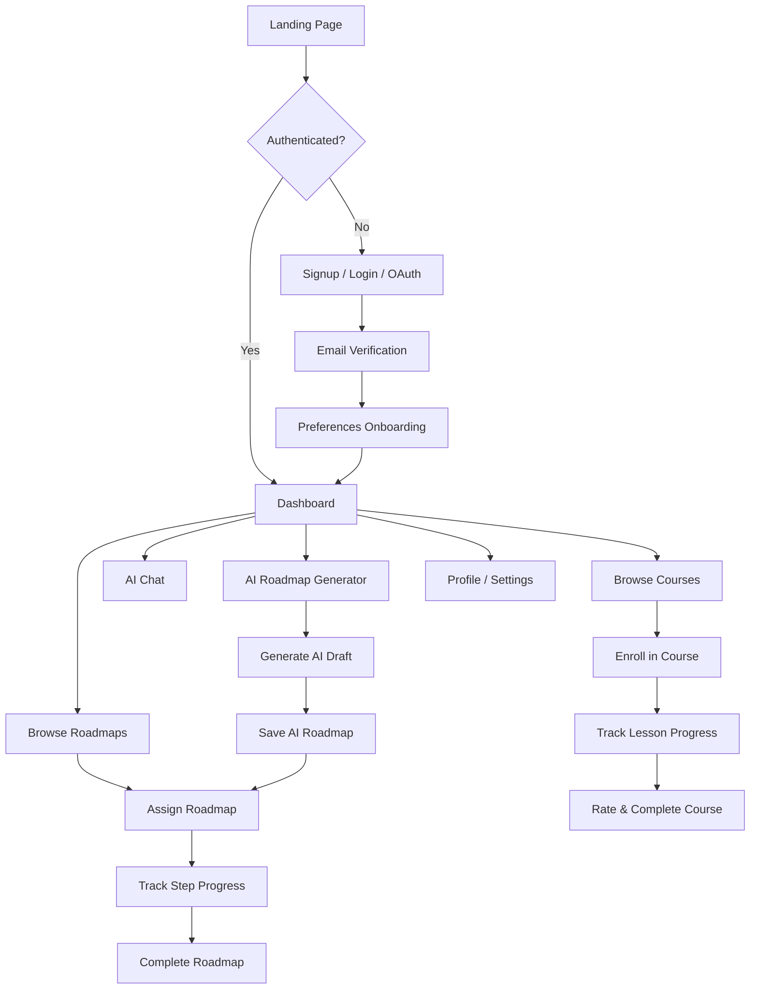
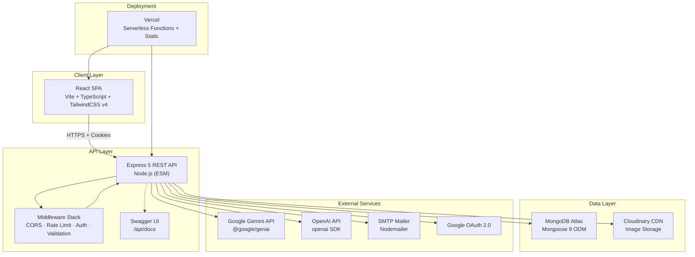
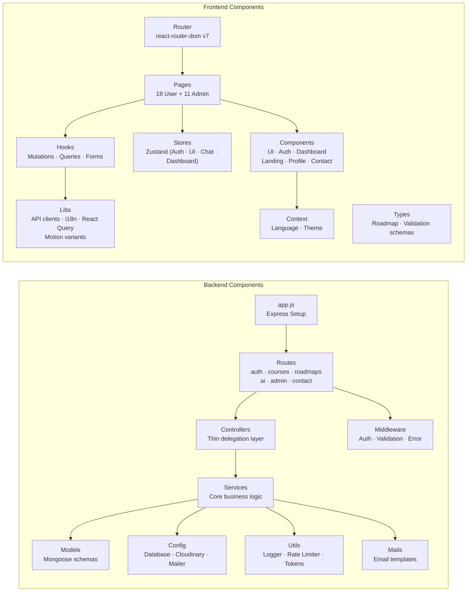
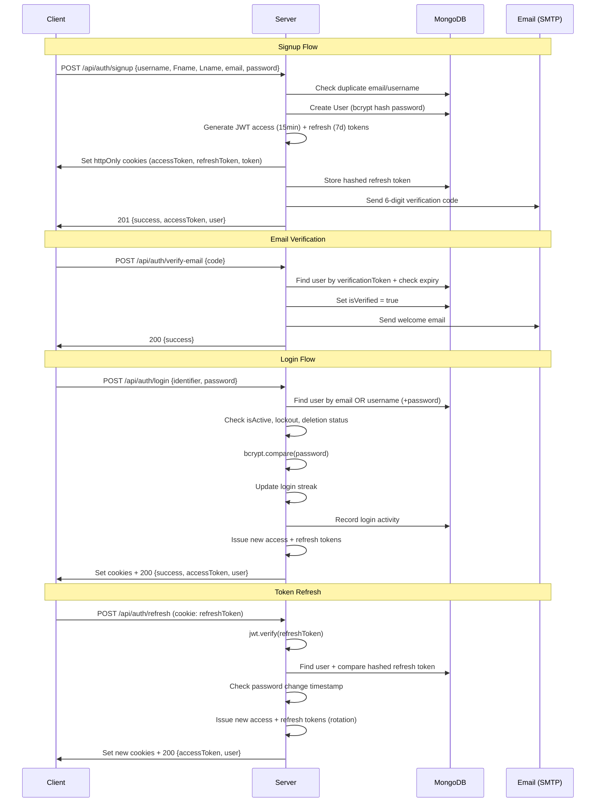
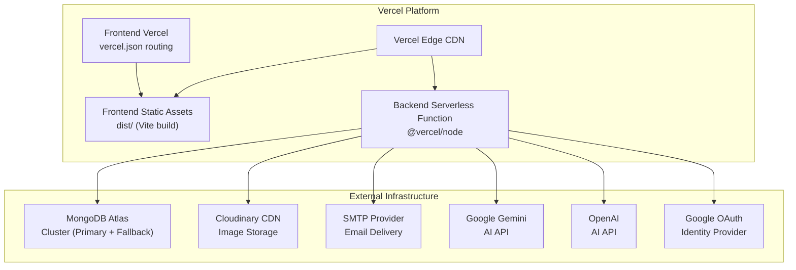

# ILMA Platform — Complete Reverse-Engineering & Architecture Documentation

> **ILMA** is an AI-powered recommendation system for Software Engineering courses designed for Arabic-speaking users. It personalizes course recommendations based on user behavior, skill level, and learning goals.

---

## 1. Project Analysis

### 1.1 Purpose

ILMA ("علم" — Arabic for "Knowledge") is a **full-stack EdTech platform** that combines:
- Structured **learning roadmaps** (step-by-step career paths)
- A **course catalog** with enrollment, progress tracking, and rating
- **AI-powered features**: personalized recommendations, roadmap generation, AI chat assistant, topic explanations
- An **admin panel** for content management, user administration, and contact message handling

### 1.2 Core Features

| Feature Area | Capabilities |
|---|---|
| **Authentication** | Signup, login (email/username), email verification (6-digit code), password reset, JWT access+refresh tokens, Google OAuth, account deactivation/deletion with undo |
| **User Profile** | Avatar upload (Cloudinary), bio, social links, headline, timezone, visibility settings |
| **User Preferences** | Interests, skill level, learning pace, preferred languages, weekly study hours, reminder preferences |
| **Learning Roadmaps** | Browse public templates, assign to self, track step-by-step progress, markdown + JSON format support |
| **Courses** | Browse published catalog, enroll, track lesson progress, rate, abandon, complete |
| **AI Recommendations** | Personalized next-step suggestions based on activity, preferences, and progress |
| **AI Roadmap Generator** | Students prompt AI to generate custom roadmaps; save to their account |
| **AI Chat** | Multi-conversation chat assistant with context awareness (page, course, roadmap) |
| **AI Topic Explain** | Deep-dive explanations for individual roadmap steps |
| **Admin Dashboard** | User management (activate/deactivate/reset), course CRUD, roadmap template CRUD, contact messages, action logging |
| **Contact Form** | Public contact form with email notification to admins, admin reply capability |
| **Internationalization** | Arabic (RTL) + English (LTR) with i18next |
| **Subscription** | Free + Pro tiers with AI usage quotas per period |

### 1.3 User Flows



### 1.4 Business Logic

- **Login Streak Tracking**: Consecutive daily logins tracked (current/longest), resets on gap
- **Account Lockout**: After N failed login attempts (default 8), account locks for 30 minutes
- **Account Deletion Workflow**: Request → email verification code → 7-day grace period → permanent purge; undo available during grace period
- **AI Usage Quotas**: Monthly limits per AI feature type (chat, roadmap draft, topic explain) based on subscription plan (free/pro)
- **Roadmap Progress Calculation**: Percentage derived from completed steps / total steps; auto-completes roadmap at 100%
- **Course Progress**: Percentage from completed lessons / total lessons across sections
- **Soft Delete**: Courses use `deletedAt` for soft deletion; AI conversations use `deletedAt`
- **Slug-Based Routing**: Both courses and roadmap templates use URL-safe slugs for public access
- **Markdown-to-Steps Parser**: Roadmap templates can be authored in Markdown (## headings become steps)

---

## 2. System Architecture

### 2.1 High-Level Architecture



### 2.2 Component Diagram



### 2.3 Database Design

> MongoDB (NoSQL) with Mongoose ODM — **14 collections** organized by domain

```mermaid
erDiagram
    User ||--o| UserProfile : "has one"
    User ||--o| UserPreference : "has one"
    User ||--o{ UserActivity : "has many"
    User ||--o{ UserRoadmap : "has many"
    User ||--o{ UserCourseProgress : "enrolls in"
    User ||--o{ UserAiUsage : "consumes"
    User ||--o{ UserAiConversation : "creates"
    User ||--o{ AdminActionLog : "admin logs"

    UserRoadmap }o--|| RoadmapTemplate : "based on"
    UserRoadmap ||--o{ UserRoadmapStepProgress : "tracks steps"
    UserRoadmapStepProgress }o--o| Course : "linked to"

    UserCourseProgress }o--|| Course : "for course"
    UserCourseProgress }o--o| UserRoadmap : "via roadmap"

    UserAiConversation ||--o{ UserAiMessage : "contains"

    RoadmapTemplate }o--o| User : "created by"
    Course }o--o| User : "instructor"
    Course }o--o| RoadmapTemplate : "linked template"

    ContactMessage ||--o{ ContactReply : "has replies"

    User {
        ObjectId _id PK
        String username UK
        String email UK
        String Fname
        String Lname
        String password
        String role
        String avatarUrl
        Boolean isVerified
        Boolean isActive
        Date lastLogin
        Object loginStreak
        Object subscription
        Object accountDeletion
        ObjectId currentRoadmap FK
    }

    UserProfile {
        ObjectId _id PK
        ObjectId user FK_UK
        String bio
        String avatarUrl
        String timeZone
        String visibility
        String headline
        String location
        String linkedInUrl
        String githubUrl
        String websiteUrl
    }

    UserPreference {
        ObjectId _id PK
        ObjectId user FK_UK
        Array interests
        Array preferredLanguages
        Array learningGoals
        String skillLevel
        String learningPace
        Array preferredCategories
        String preferredDifficulty
        Number weeklyStudyHours
        String reminderPreference
    }

    Course {
        ObjectId _id PK
        String title
        String slug UK
        String description
        String shortDescription
        String level
        String language
        Array tags
        String category
        ObjectId instructor FK
        String thumbnailUrl
        String bannerUrl
        Number durationMinutes
        Array sections
        Array prerequisites
        Array learningOutcomes
        Boolean isPublished
        Boolean isFeatured
        Object stats
        Date deletedAt
    }

    RoadmapTemplate {
        ObjectId _id PK
        String title
        String slug UK
        String goal
        String description
        String targetRole
        String targetLevel
        String templateType
        Array tags
        Array steps
        String contentFormat
        String contentMarkdown
        Number estimatedTotalMinutes
        ObjectId createdBy FK
        ObjectId owner FK
        String visibility
        String source
        Boolean isActive
    }

    UserRoadmap {
        ObjectId _id PK
        ObjectId user FK
        ObjectId template FK
        String status
        Number currentStepIndex
        Number progressPercent
        Date targetDate
        Date startedAt
        Date completedAt
        String notes
    }

    UserRoadmapStepProgress {
        ObjectId _id PK
        ObjectId user FK
        ObjectId roadmap FK
        ObjectId template FK
        String stepKey
        ObjectId course FK
        String status
        Number score
        Number timeSpentMinutes
        Number attempts
        String notes
    }

    UserCourseProgress {
        ObjectId _id PK
        ObjectId user FK
        ObjectId course FK
        ObjectId roadmap FK
        String status
        String currentLesson
        Array completedLessonIds
        Number progressPercent
        Number watchedMinutes
        Number rating
        String notes
    }

    UserActivity {
        ObjectId _id PK
        ObjectId user FK
        String type
        ObjectId course FK
        ObjectId roadmap FK
        String roadmapStepKey
        Object metadata
        Number durationMinutes
        Number score
        String searchQuery
        String device
        String ipAddress
        Date occurredAt
    }

    UserAiConversation {
        ObjectId _id PK
        ObjectId user FK
        String title
        Object context
        Date lastMessageAt
        Date deletedAt
    }

    UserAiMessage {
        ObjectId _id PK
        ObjectId conversation FK
        ObjectId user FK
        String role
        String content
        String provider
        String model
        Number promptTokens
        Number completionTokens
        Number totalTokens
        Array links
    }

    UserAiUsage {
        ObjectId _id PK
        ObjectId user FK
        String type
        Date periodStart
        Number count
        Number promptTokens
        Number completionTokens
        Number totalTokens
    }

    AdminActionLog {
        ObjectId _id PK
        ObjectId admin FK
        String action
        String targetType
        ObjectId targetId
        Object metadata
        String ipAddress
        String userAgent
    }

    ContactMessage {
        ObjectId _id PK
        String name
        String email
        String message
        String status
        Array replies
        String ipAddress
        String userAgent
    }

    ContactReply {
        ObjectId admin FK
        String message
        String messageId
        Date sentAt
    }
```

### 2.4 Authentication Flow



### 2.5 Deployment Architecture



---

## 3. Folder Structure

```
project/
├── .env                              # Backend environment variables
├── .env.local                        # Local overrides (gitignored)
├── .gitignore
├── jsconfig.json                     # Module path aliases
├── package.json                      # Root (backend) package.json
├── vercel.json                       # Vercel deployment config
│
├── backend/
│   ├── app.js                        # Express application setup
│   ├── server.js                     # Server entry point (listen + error handlers)
│   │
│   ├── config/
│   │   ├── cloudinary.js             # Cloudinary upload/resolve utilities
│   │   ├── database.js               # MongoDB connection (primary + fallback)
│   │   └── mailer.js                 # Nodemailer SMTP transporter
│   │
│   ├── controllers/
│   │   ├── admin.controller.js       # Admin route delegation
│   │   ├── ai.controller.js          # AI route delegation
│   │   ├── auth.controller.js        # Auth route delegation
│   │   └── roadmap.controller.js     # Roadmap route delegation
│   │
│   ├── docs/
│   │   └── swagger.js                # Swagger/OpenAPI spec generation
│   │
│   ├── helpers/
│   │   ├── auth.helpers.js           # Verification token gen, login streak, toPublicUser
│   │   ├── date.js                   # Date utilities
│   │   ├── errors.js                 # Custom error classes
│   │   ├── pagination.js             # Pagination helpers
│   │   ├── response.js               # Standardized response builders
│   │   └── text.js                   # Text utilities (slugify, etc.)
│   │
│   ├── mails/
│   │   └── emails.js                 # Email sending functions (verification, welcome, reset)
│   │
│   ├── middleware/
│   │   ├── adminValidators.js        # Zod-based admin route validation
│   │   ├── authValidators.js         # Zod-based auth route validation
│   │   ├── contactValidators.js      # Zod-based contact validation
│   │   ├── courseValidators.js        # Zod-based course validation
│   │   ├── errorHandler.js           # Centralized error handler middleware
│   │   ├── protectsRoutes.js         # JWT auth guard + role authorization
│   │   ├── roadmapValidators.js      # Zod-based roadmap validation
│   │   └── validate.js               # Generic Zod validation middleware factory
│   │
│   ├── models/
│   │   ├── admin/
│   │   │   └── adminActionLogModel.js
│   │   ├── contact/
│   │   │   └── contactMessageModel.js
│   │   ├── course/
│   │   │   └── courseModel.js
│   │   ├── roadmap/
│   │   │   └── roadmapTemplateModel.js
│   │   └── user/
│   │       ├── userAccountModel.js
│   │       ├── userActivityModel.js
│   │       ├── userAiConversationModel.js
│   │       ├── userAiMessageModel.js
│   │       ├── userAiUsageModel.js
│   │       ├── userCourseProgressModel.js
│   │       ├── userPreferenceModel.js
│   │       ├── userProfileModel.js
│   │       ├── userRoadmapModel.js
│   │       └── userRoadmapStepProgressModel.js
│   │
│   ├── routes/
│   │   ├── admin.route.js            # Admin API routes (CRUD users, courses, roadmaps, contacts)
│   │   ├── ai.route.js               # AI API routes (recommendations, chat, roadmap draft)
│   │   ├── auth.route.js             # Auth API routes (signup, login, verify, reset, profile)
│   │   ├── contact.route.js          # Contact form API route
│   │   ├── courses.route.js          # Course API routes (browse, enroll, progress, rate)
│   │   └── roadmaps.route.js         # Roadmap API routes (templates, assign, progress)
│   │
│   ├── services/
│   │   ├── account.service.js        # Account management (profile, password, deactivation, deletion)
│   │   ├── admin.service.js          # Admin dashboard service
│   │   ├── admin/
│   │   │   ├── admin-auth.service.js     # Admin authentication
│   │   │   ├── admin-contact.service.js  # Admin contact message management
│   │   │   ├── admin-course.service.js   # Admin course CRUD
│   │   │   ├── admin-log.service.js      # Admin action logging
│   │   │   ├── admin-roadmap.service.js  # Admin roadmap template management
│   │   │   ├── admin-shared.js           # Shared admin utilities
│   │   │   └── admin-user.service.js     # Admin user management
│   │   ├── ai/
│   │   │   ├── cache.js                  # TTL cache for AI responses
│   │   │   ├── chat.js                   # AI chat conversation service
│   │   │   ├── parsers/                  # AI response parsers
│   │   │   ├── prompts/                  # AI prompt templates
│   │   │   ├── provider.js               # AI provider abstraction (Gemini/OpenAI)
│   │   │   ├── recommendations.js        # Recommendation engine
│   │   │   ├── roadmap-draft.js          # AI roadmap generation
│   │   │   ├── topic-explain.js          # AI topic explanation
│   │   │   └── usage.js                  # AI usage tracking & quota enforcement
│   │   ├── ai.service.js             # AI service orchestrator
│   │   ├── auth.service.js           # Authentication business logic
│   │   ├── contact.service.js        # Contact form service
│   │   ├── courses.service.js        # Course business logic
│   │   ├── oauth.service.js          # Google OAuth integration
│   │   ├── roadmap.service.js        # User roadmap business logic
│   │   ├── roadmap-template.service.js # Roadmap template CRUD + markdown parser
│   │   └── user.service.js           # User profile/preferences service
│   │
│   ├── test/                         # Backend test suite
│   │
│   ├── utils/
│   │   ├── emailsTemplate.js         # HTML email templates (22KB)
│   │   ├── generateTokenSetCookie.js # JWT token generation + cookie management
│   │   ├── logger.js                 # Winston logger configuration
│   │   └── rateLimiter.js            # express-rate-limit configurations
│   │
│   └── validation/
│       └── ai.schemas.js             # Zod schemas for AI endpoints
│
├── frontend/
│   ├── index.html                    # HTML entry (SEO meta tags, OG, Twitter cards)
│   ├── package.json                  # Frontend dependencies
│   ├── vite.config.ts                # Vite + React + Tailwind + Babel (React Compiler)
│   ├── tsconfig.json                 # TypeScript config
│   ├── vercel.json                   # Frontend Vercel routing
│   ├── eslint.config.js
│   │
│   └── src/
│       ├── App.tsx                   # Router provider with Suspense
│       ├── main.tsx                  # React entry (QueryClientProvider + i18n init)
│       ├── router.tsx                # Complete route definitions (29 routes)
│       │
│       ├── assets/                   # Static assets (images, icons)
│       │
│       ├── components/
│       │   ├── auth/                 # Login/Signup forms, verify email, reset password
│       │   ├── common/               # Shared components (buttons, inputs, cards)
│       │   ├── contact/              # Contact form component
│       │   ├── dashboard/            # Dashboard widgets and cards
│       │   ├── landing/              # Homepage hero, features, sections
│       │   ├── models/               # 3D models (Three.js logo)
│       │   ├── profile/              # Profile editing components
│       │   └── ui/                   # Base UI components (fallback, modals)
│       │
│       ├── context/
│       │   ├── LanguageContext.tsx    # i18n language + direction (LTR/RTL) provider
│       │   └── ThemeContext.tsx       # Dark/Light theme provider
│       │
│       ├── hooks/
│       │   ├── mutations/            # React Query mutation hooks
│       │   ├── queries/              # React Query query hooks
│       │   ├── useContactForm.ts
│       │   ├── useGoogleAuthRedirect.ts
│       │   ├── useLoginPage.ts
│       │   ├── useResendCooldown.ts
│       │   ├── useResetPasswordPage.ts
│       │   ├── useRoadmapData.ts
│       │   ├── useSignupPage.ts
│       │   ├── useUserRoadmapProgress.ts
│       │   └── useVerifyEmailPage.ts
│       │
│       ├── libs/
│       │   ├── admin-api.ts          # Admin API client (18KB)
│       │   ├── ai-api.ts             # AI API client (8.5KB)
│       │   ├── contact-api.ts        # Contact API client
│       │   ├── courses-api.ts        # Courses API client
│       │   ├── i18n.ts               # i18next configuration
│       │   ├── motionVariants.ts     # Framer Motion animation presets (7.2KB)
│       │   ├── react-query.ts        # TanStack React Query setup
│       │   ├── roadmaps-api.ts       # Roadmaps API client (6.4KB)
│       │   └── user-api.ts           # User/Auth API client (11KB)
│       │
│       ├── locales/
│       │   ├── ar/                   # Arabic translations
│       │   └── en/                   # English translations
│       │
│       ├── routes/
│       │   ├── admin/                # 11 Admin pages
│       │   │   ├── AdminContactMessagesPage.tsx
│       │   │   ├── AdminCourseDetailPage.tsx
│       │   │   ├── AdminCoursesPage.tsx
│       │   │   ├── AdminDashboardPage.tsx
│       │   │   ├── AdminForgotPasswordPage.tsx
│       │   │   ├── AdminLoginPage.tsx
│       │   │   ├── AdminProfilePage.tsx
│       │   │   ├── AdminResetPasswordPage.tsx
│       │   │   ├── AdminRoadmapDetailPage.tsx
│       │   │   ├── AdminRoadmapsPage.tsx
│       │   │   ├── AdminUsersPage.tsx
│       │   │   └── tabs/
│       │   ├── common/               # Shared route components
│       │   │   ├── GoogleIcon.tsx
│       │   │   ├── NotFound.tsx
│       │   │   ├── RouteErrorPage.tsx
│       │   │   └── layouts.tsx       # RootLayout, LanguageLayout, ClientLayout, AdminLayout
│       │   └── user/                 # 18 User pages
│       │       ├── AiChatPage.tsx        # (29KB) Full AI chat interface
│       │       ├── AiRoadmapPage.tsx     # (20KB) AI roadmap generator
│       │       ├── ContactUsPage.tsx
│       │       ├── CoursePage.tsx
│       │       ├── DashboardPage.tsx
│       │       ├── FaqsPage.tsx
│       │       ├── ForgotPasswordPage.tsx
│       │       ├── GuidePage.tsx
│       │       ├── HomePage.tsx
│       │       ├── LoginPage.tsx
│       │       ├── MyRoadmapsPage.tsx    # (16KB) Roadmap management
│       │       ├── PreferencesPage.tsx   # (26KB) Learning preferences
│       │       ├── ProfilePage.tsx
│       │       ├── ResetPasswordPage.tsx
│       │       ├── RoadmapPage.tsx       # React Flow graph visualization
│       │       ├── SignupPage.tsx
│       │       ├── UpgradePage.tsx
│       │       └── VerifyEmailPage.tsx
│       │
│       ├── stores/
│       │   ├── useAiChatStore.ts     # Zustand: AI chat state
│       │   ├── useAuthSessionStore.ts # Zustand: Auth session state
│       │   ├── useDashboardStore.ts  # Zustand: Dashboard state
│       │   └── useUiStore.ts         # Zustand: UI state (sidebar, modals)
│       │
│       ├── style/
│       │   └── index.css             # Global styles + Tailwind v4
│       │
│       ├── types/
│       │   ├── roadmap.ts            # Roadmap TypeScript types
│       │   └── validationSchemas.ts  # Zod validation schemas
│       │
│       └── utils/
│           ├── api.ts                # Axios/fetch wrapper with token refresh
│           ├── backendResponseMessage.ts # Error message i18n mapping
│           ├── favicon.ts            # Dynamic favicon management
│           ├── graphBuilder.ts       # React Flow roadmap graph builder (10.8KB)
│           ├── passwordGenerator.ts  # Secure password generator
│           ├── route-utils.ts        # Route loaders/actions (auth guards, data fetching)
│           ├── routes.lazy.ts        # Lazy-loaded route components
│           └── threeLogoModel.ts     # Three.js 3D logo animation (4.5KB)
│
└── logs/                             # Winston log files
```

---

## 4. Technology Stack

### Frontend

| Technology | Version | Purpose |
|---|---|---|
| **React** | 19.2 | UI framework |
| **TypeScript** | 6.0 | Type safety |
| **Vite** | 8.0 | Build tool + HMR dev server |
| **TailwindCSS** | 4.3 | Utility-first CSS framework |
| **React Router** | 7.16 | Client-side routing (29 routes) |
| **TanStack React Query** | 5.100 | Server state management + caching |
| **Zustand** | 5.0 | Client state management (4 stores) |
| **Framer Motion** | 12.40 | Animation library |
| **React Hook Form** | 7.76 | Form management |
| **Zod** | 4.4 | Schema validation |
| **i18next** | 26.3 | Internationalization (AR/EN) |
| **@xyflow/react** | 12.10 | Roadmap graph visualization (React Flow) |
| **Three.js** | 0.184 | 3D logo animation |
| **Sonner** | 2.0 | Toast notifications |
| **@hugeicons/react** | 1.1 | Icon library |
| **React Compiler** | 1.0 (babel-plugin) | Automatic memoization |

### Backend

| Technology | Version | Purpose |
|---|---|---|
| **Node.js** | ESM (ES Modules) | Runtime |
| **Express** | 5.2 | Web framework |
| **Mongoose** | 9.6 | MongoDB ODM |
| **jsonwebtoken** | 9.0 | JWT authentication |
| **bcryptjs** | 3.0 | Password hashing |
| **Zod** | 4.4 | Input validation |
| **@google/genai** | 2.8 | Google Gemini AI |
| **openai** | 6.42 | OpenAI API |
| **nodemailer** | 8.0 | Email delivery |
| **cloudinary** | 2.10 | Image CDN (used via REST API, not SDK) |
| **cors** | 2.8 | Cross-origin requests |
| **express-rate-limit** | 8.5 | API rate limiting |
| **winston** | 3.19 | Structured logging |
| **morgan** | 1.10 | HTTP request logging |
| **nanoid** | 5.1 | ID generation |
| **swagger-jsdoc** | 6.3 | OpenAPI spec from JSDoc |
| **swagger-ui-dist** | 5.32 | Swagger documentation UI |
| **cookie-parser** | 1.4 | Cookie parsing |

### Database

| Component | Details |
|---|---|
| **Engine** | MongoDB Atlas (cloud-hosted) |
| **ODM** | Mongoose 9 |
| **Database** | `iti_Grad_Project` |
| **Collections** | 14 collections (see ERD) |
| **Connection Strategy** | Reusable promise (serverless-optimized), primary + fallback URL |
| **Timeouts** | Server selection: 15s, Socket: 45s |

### Authentication

| Mechanism | Details |
|---|---|
| **Strategy** | JWT (Access + Refresh token rotation) |
| **Access Token** | 15-minute expiry, httpOnly cookie |
| **Refresh Token** | 7-day expiry, httpOnly cookie, hashed in DB |
| **Password Hashing** | bcrypt with configurable salt rounds (default 12) |
| **Email Verification** | 6-digit code, 24-hour expiry |
| **Password Reset** | SHA-256 hashed token, 1-hour expiry |
| **OAuth** | Google OAuth 2.0 (login + signup) |
| **Account Lockout** | 8 failed attempts → 30-minute lock |
| **Cookie Settings** | httpOnly, secure (production), sameSite: none (production) / strict (dev) |

### Storage

| Service | Purpose |
|---|---|
| **Cloudinary** | Course thumbnails, banners, user avatars |
| **Upload Method** | Direct REST API with SHA-1 signed params |
| **Max Avatar Size** | 3MB |
| **Folders** | `ilma/courses`, `ilma/avatars` |

### DevOps

| Component | Details |
|---|---|
| **Hosting** | Vercel (serverless functions + static) |
| **CI/CD** | Vercel Git integration (auto-deploy) |
| **Logging** | Winston (file + console) |
| **DNS** | Configurable via `DNS_SERVERS` env var |
| **Error Handling** | Centralized middleware + process-level handlers |

---

## 5. Database Schema

### 5.1 Collections & Indexes

| Collection | Unique Constraints | Compound Indexes | Text Indexes |
|---|---|---|---|
| `users` | `username`, `email` | `role`, `isActive`, `subscription.plan`, `subscription.status`, `accountDeletion.status`, `accountDeletion.scheduledFor` | — |
| `userprofiles` | `user` | `visibility` | — |
| `userpreferences` | `user` | `skillLevel`, `learningPace` | — |
| `useractivities` | — | `{user, type, occurredAt}` | — |
| `userroadmaps` | `{user, template}` | `status` | — |
| `userroadmapstepprogresses` | `{user, roadmap, stepKey}` | `status`, `template` | — |
| `usercourseprogresses` | `{user, course}` | `status` | — |
| `useraiconversations` | — | `{user, lastMessageAt}`, `deletedAt` | — |
| `useraimessages` | — | `{conversation, createdAt}`, `user`, `role` | — |
| `useraiusages` | `{user, type, periodStart}` | — | — |
| `courses` | `slug` | `title`, `level`, `language`, `category`, `isPublished`, `deletedAt` | `{title, description, tags}` |
| `roadmaptemplates` | `slug` | `title`, `targetRole`, `targetLevel`, `templateType`, `contentFormat`, `visibility`, `owner` | `{title, goal, description, tags, steps.title, steps.description, steps.stepKey, contentMarkdown}` |
| `adminactionlogs` | — | `{admin, createdAt}`, `{targetType, createdAt}` | — |
| `contactmessages` | — | `{createdAt}`, `{status, createdAt}`, `email` | `{name, email, message}` |

### 5.2 Key Schema Constraints

- **User.password**: `select: false` (excluded from queries by default), `min: 8 chars`
- **User.username**: `min: 3`, `max: 20`, `lowercase`, `trimmed`
- **User.role**: enum `[student, instructor, admin]`
- **User.subscription.plan**: enum `[free, pro]`
- **Course.sections.lessons**: Embedded array with `lessonKey`, `title`, `durationMinutes`, `videoUrl`, `isPreview`
- **RoadmapTemplate.steps**: Embedded array with `stepKey`, `title`, `order`, `dependsOn[]`, `resources[]`
- **UserActivity.type**: 16 activity types covering all user interactions
- **UserAiUsage**: Unique per `{user, type, periodStart}` for monthly quota tracking
- **ContactMessage.replies**: Embedded array of admin replies with `sentAt` timestamps

---

## 6. API Specification

### 6.1 Auth Routes (`/api/auth`)

| Method | Route | Auth | Rate Limit | Validation | Description |
|---|---|---|---|---|---|
| `POST` | `/signup` | Public | — | `signupValidation` + `signupUniquenessValidation` | Register new user |
| `POST` | `/verify-email` | Public | — | `verifyEmailValidation` | Verify email with 6-digit code |
| `POST` | `/resend-verification-code` | Public | `resendVerificationLimiter` | `resendVerificationValidation` | Resend verification code |
| `POST` | `/login` | Public | `loginLimiter` | `loginValidation` | Login with email/username + password |
| `POST` | `/refresh` | Public (cookie) | — | — | Refresh access token |
| `POST` | `/forgot-password` | Public | `forgotPasswordLimiter` | `forgetPasswordValidation` | Request password reset email |
| `POST` | `/resend-reset-password` | Public | `forgotPasswordLimiter` | `forgetPasswordValidation` | Resend password reset email |
| `POST` | `/reset-password/:token` | Public | — | `resetPasswordValidation` | Reset password with token |
| `GET` | `/oauth/login/google` | Public | — | — | Start Google OAuth login |
| `GET` | `/oauth/signup/google` | Public | — | — | Start Google OAuth signup |
| `GET` | `/oauth/google/callback` | Public | — | — | Google OAuth callback |
| `POST` | `/account/delete/undo/request` | Public | `loginLimiter` | `accountDeleteUndoRequestValidation` | Request account deletion undo |
| `POST` | `/account/delete/undo/confirm` | Public | — | `accountDeleteCodeValidation` | Confirm account deletion undo |
| `POST` | `/logout` | Public | — | — | Logout (clear cookies) |
| `GET` | `/check-auth` | Protected | — | — | Check current auth state |
| `GET` | `/preferences` | Protected | — | — | Get user preferences |
| `PATCH` | `/preferences` | Protected | — | `preferencesUpdateValidation` | Update user preferences |
| `GET` | `/dashboard-summary` | Protected | — | — | Get dashboard stats |
| `DELETE` | `/activities/:activityId` | Protected | — | — | Delete activity record |
| `PATCH` | `/profile` | Protected | — | `profileUpdateValidation` | Update user profile |
| `PATCH` | `/profile/avatar` | Protected | — | `avatarUpdateValidation` | Update avatar (base64 → Cloudinary) |
| `PATCH` | `/password` | Protected | — | `updatePasswordValidation` | Change password |
| `POST` | `/account/deactivate` | Protected | — | `accountPasswordActionValidation` | Deactivate own account |
| `POST` | `/account/delete/request` | Protected | — | `accountPasswordActionValidation` | Request account deletion |
| `POST` | `/account/delete/confirm` | Protected | — | `accountDeleteCodeValidation` | Confirm account deletion |

#### Request/Response Examples

**POST `/api/auth/signup`**
```json
// Request
{
  "username": "ahmed_dev",
  "Fname": "Ahmed",
  "Lname": "Salah",
  "email": "ahmed@example.com",
  "password": "SecureP@ss123"
}

// Success Response (201)
{
  "success": true,
  "message": "User created successfully",
  "accessToken": "eyJhbG...",
  "user": {
    "_id": "...",
    "username": "ahmed_dev",
    "Fname": "Ahmed",
    "Lname": "Salah",
    "email": "ahmed@example.com",
    "role": "student",
    "isVerified": false,
    "isActive": true,
    "loginStreak": { "current": 1, "longest": 1 },
    "subscription": { "plan": "free", "status": "inactive" }
  }
}

// Conflict Response (409)
{
  "success": false,
  "message": "Validation failed.",
  "errors": [{ "field": "email", "message": "Email is already registered." }]
}
```

**POST `/api/auth/login`**
```json
// Request
{
  "identifier": "ahmed@example.com",
  "password": "SecureP@ss123"
}

// Success Response (200)
{
  "success": true,
  "message": "Login successful.",
  "accessToken": "eyJhbG...",
  "user": { /* public user fields */ }
}

// Locked Response (423)
{
  "success": false,
  "message": "Account locked until 6/19/2026, 4:00:00 PM due to multiple failed login attempts.",
  "lockUntil": "2026-06-19T13:00:00.000Z"
}
```

---

### 6.2 Course Routes (`/api/courses`)

| Method | Route | Auth | Validation | Description |
|---|---|---|---|---|
| `GET` | `/published` | Public | — | List published courses (filter: q, level, category, limit) |
| `GET` | `/published/:slug` | Public | — | Get published course by slug |
| `POST` | `/enroll` | Student | `enrollCourseValidation` + `validateCourseExists` + `validateEnrollmentStatus` | Enroll in a course |
| `GET` | `/` | Student | — | Get user's enrolled courses (filter: status) |
| `GET` | `/:courseId` | Student | `validateUserEnrollment` | Get course progress |
| `PUT` | `/:courseId/progress` | Student | `updateCourseProgressValidation` + `validateUserEnrollment` | Update lesson progress |
| `POST` | `/:courseId/complete` | Student | `completeCourseValidation` + `validateUserEnrollment` | Mark course completed |
| `POST` | `/:courseId/rate` | Student | `rateCourseValidation` + `validateUserEnrollment` | Rate a course (1-5) |
| `POST` | `/:courseId/abandon` | Student | `validateUserEnrollment` | Abandon enrolled course |

---

### 6.3 Roadmap Routes (`/api/roadmaps`)

| Method | Route | Auth | Validation | Description |
|---|---|---|---|---|
| `GET` | `/search` | Public | — | Search roadmaps and topics (q, targetLevel, targetRole, templateType) |
| `GET` | `/templates` | Public | — | List all templates (paginated, filtered) |
| `GET` | `/templates/by-slug/:slug` | Public | — | Get template by slug |
| `GET` | `/templates/:templateId` | Public | — | Get template by ID |
| `GET` | `/templates/:templateId/topics/:stepKey` | Public | — | Get specific roadmap topic/step |
| `GET` | `/my-templates/by-slug/:slug` | Protected | — | Get template by slug (includes private owned) |
| `POST` | `/templates` | Admin | `createRoadmapTemplateValidation` | Create roadmap template |
| `PUT` | `/templates/:templateId` | Admin | `updateRoadmapTemplateValidation` + `validateUniqueSlug` | Update roadmap template |
| `DELETE` | `/templates/:templateId` | Admin | `validateTemplateExistsInParams` | Delete roadmap template |
| `POST` | `/templates/:templateId/publish` | Admin | `publishTemplateValidation` | Publish template |
| `POST` | `/templates/:templateId/unpublish` | Admin | — | Unpublish template |
| `POST` | `/templates/:templateId/steps` | Admin | — | Add step to template |
| `DELETE` | `/templates/:templateId/steps/:stepKey` | Admin | — | Remove step from template |
| `POST` | `/assign` | Student | `assignRoadmapValidation` + `validateTemplateExists` | Assign roadmap to self |
| `GET` | `/` | Student | — | Get user's roadmaps |
| `GET` | `/:roadmapId` | Student | — | Get roadmap progress with steps |
| `DELETE` | `/:roadmapId` | Student | `validateRoadmapExists` | Delete user's roadmap assignment |
| `PUT` | `/:roadmapId/steps/:stepKey/progress` | Student | `updateStepProgressValidation` + `validateRoadmapExists` | Update step progress |

---

### 6.4 AI Routes (`/api/ai`)

> All routes require authentication (`protect` middleware)

| Method | Route | Role | Rate Limit | Validation | Description |
|---|---|---|---|---|---|
| `GET` | `/recommendations` | Student | `aiRecommendationLimiter` | — | Get personalized recommendations |
| `GET` | `/features/access` | Student | `aiRecommendationLimiter` | — | Get AI feature access/quota status |
| `GET` | `/chat/conversations` | Student | `aiRecommendationLimiter` | — | List AI chat conversations |
| `POST` | `/chat/conversations` | Student | `aiRecommendationLimiter` | `createChatConversationSchema` | Create new AI chat conversation |
| `GET` | `/chat/conversations/:conversationId/messages` | Student | `aiRecommendationLimiter` | — | Get messages in conversation |
| `POST` | `/chat/conversations/:conversationId/messages` | Student | `aiRecommendationLimiter` | `sendChatMessageSchema` | Send message to AI |
| `PATCH` | `/chat/conversations/:conversationId` | Student | `aiRecommendationLimiter` | `updateChatConversationSchema` | Update conversation title |
| `DELETE` | `/chat/conversations/:conversationId` | Student | `aiRecommendationLimiter` | — | Soft-delete conversation |
| `POST` | `/roadmaps/user-draft` | Student | `aiRecommendationLimiter` | `userRoadmapPromptSchema` | Generate AI roadmap draft |
| `POST` | `/roadmaps/save` | Student | `aiRecommendationLimiter` | `saveAiRoadmapSchema` | Save AI-generated roadmap |
| `POST` | `/topics/explain` | Student | `aiRecommendationLimiter` | `explainTopicSchema` | Get AI explanation for a topic |
| `POST` | `/roadmaps/draft` | **Admin** | `aiRecommendationLimiter` | `roadmapDraftSchema` | Generate admin roadmap draft |

#### AI Feature Access Response
```json
{
  "success": true,
  "data": {
    "plan": "free",
    "ai_chat": { "used": 3, "limit": 10, "remaining": 7 },
    "ai_roadmap_draft": { "used": 1, "limit": 3, "remaining": 2 },
    "ai_topic_explain": { "used": 0, "limit": 5, "remaining": 5 },
    "periodStart": "2026-06-01T00:00:00.000Z",
    "periodEnd": "2026-07-01T00:00:00.000Z"
  }
}
```

---

### 6.5 Admin Routes (`/api/admin`)

| Method | Route | Auth | Description |
|---|---|---|---|
| `GET` | `/users` | Admin | List all users (paginated, searchable) |
| `GET` | `/users/:userId` | Admin | Get user details |
| `PATCH` | `/users/:userId/activate` | Admin | Activate user account |
| `PATCH` | `/users/:userId/deactivate` | Admin | Deactivate user account |
| `PATCH` | `/users/:userId/reset-password` | Admin | Admin reset user password |
| `PATCH` | `/users/:userId/role` | Admin | Change user role |
| `GET` | `/courses` | Admin | List all courses (including unpublished) |
| `GET` | `/courses/:courseId` | Admin | Get course details |
| `POST` | `/courses` | Admin | Create new course |
| `PUT` | `/courses/:courseId` | Admin | Update course |
| `DELETE` | `/courses/:courseId` | Admin | Soft-delete course |
| `POST` | `/courses/:courseId/publish` | Admin | Publish course |
| `POST` | `/courses/:courseId/unpublish` | Admin | Unpublish course |
| `GET` | `/roadmaps/templates` | Admin | List all templates (admin view) |
| `GET` | `/roadmaps/templates/:templateId` | Admin | Get template details (admin view) |
| `POST` | `/roadmaps/templates` | Admin | Create template |
| `PUT` | `/roadmaps/templates/:templateId` | Admin | Update template |
| `DELETE` | `/roadmaps/templates/:templateId` | Admin | Delete template |
| `GET` | `/contact-messages` | Admin | List contact messages |
| `GET` | `/contact-messages/:messageId` | Admin | Get message details |
| `PATCH` | `/contact-messages/:messageId/read` | Admin | Mark message as read |
| `POST` | `/contact-messages/:messageId/reply` | Admin | Reply to contact message |
| `GET` | `/logs` | Admin | Get admin action logs |
| `GET` | `/dashboard` | Admin | Get admin dashboard stats |
| `POST` | `/login` | Public | Admin login |
| `POST` | `/logout` | Admin | Admin logout |

---

### 6.6 Contact Routes (`/api/contact`)

| Method | Route | Auth | Rate Limit | Validation | Description |
|---|---|---|---|---|---|
| `POST` | `/` | Public | `contactLimiter` | `contactValidation` | Send contact form message |

```json
// Request
{
  "name": "Ahmed Salah",
  "email": "ahmed@example.com",
  "message": "I need help with my learning roadmap."
}

// Success Response (200)
{
  "success": true,
  "message": "Your message has been sent successfully."
}
```

---

### 6.7 System Routes

| Method | Route | Description |
|---|---|---|
| `GET` | `/` | Root — confirms backend is running |
| `GET` | `/api/health` | Health check endpoint |
| `GET` | `/api/docs` | Swagger UI documentation |
| `GET` | `/api/docs/swagger.json` | OpenAPI JSON spec |

---

### 6.8 Error Response Format

All error responses follow a consistent format:

```json
{
  "success": false,
  "message": "Human-readable error message.",
  "errors": [
    {
      "field": "email",
      "message": "Email is already registered."
    }
  ],
  "code": "OPTIONAL_ERROR_CODE",
  "error": "Technical error details (development only)"
}
```

| HTTP Status | Meaning |
|---|---|
| `400` | Validation error / Bad request |
| `401` | Authentication required or invalid credentials |
| `402` | AI quota exceeded (payment required) |
| `403` | Forbidden (deactivated account, wrong role) |
| `404` | Resource not found |
| `409` | Conflict (duplicate email, username, slug) |
| `423` | Account locked |
| `429` | Rate limit exceeded |
| `500` | Internal server error |
| `502` | External service failure (Cloudinary, AI) |
| `503` | Database unavailable |
| `504` | External service timeout |

---

## Open Questions

> [!IMPORTANT]
> **What is the scope of "fully reconstruct"?** This existing codebase is already a complete, production-quality application with ~80+ source files across 14 backend modules and 29 frontend pages. Please clarify which of these you'd like me to work on:

1. **Documentation only** — You want this analysis document as a reference for the existing codebase
2. **Refactor/restructure** — You want me to restructure the existing code following stricter clean architecture patterns (e.g., separate repository layer, use cases, dependency injection)
3. **Rebuild from scratch** — You want me to recreate all files from zero, writing every line of production code (this would be a massive undertaking of 50,000+ lines)
4. **Fill gaps** — You want me to identify and implement missing features, improve error handling, add tests, or fix architectural issues in the existing code
5. **Something specific** — A particular area you'd like reconstructed (e.g., only the AI subsystem, only the admin panel, etc.)

> [!WARNING]
> The frontend has **~180KB of page components** alone (e.g., AiChatPage: 29KB, AdminUsersPage: 40KB, PreferencesPage: 26KB). Fully regenerating all files would be an extremely large task. Please specify your priority areas.
