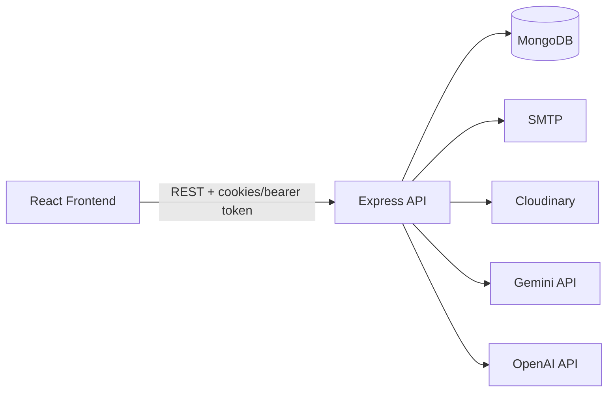
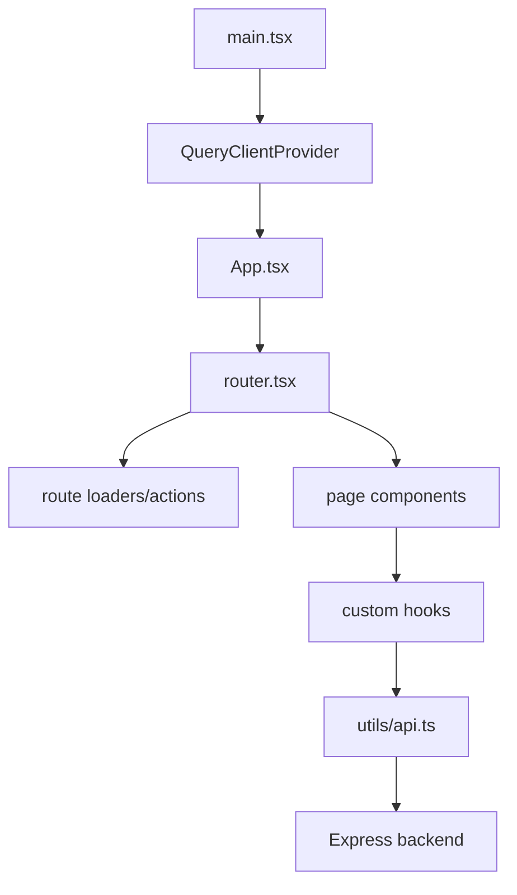
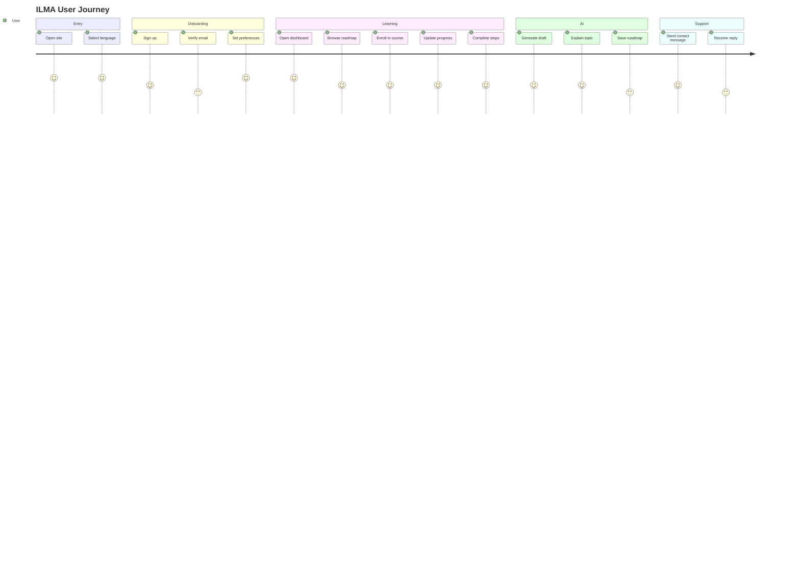

# ILMA Project Specification

## 1. Executive Summary

ILMA is a bilingual learning platform built as a React + TypeScript frontend and an Express + MongoDB backend. The current workspace already includes authentication, roadmap templates, course progress tracking, AI-assisted roadmap generation, AI recommendations, admin moderation, contact handling, logging, validation, and OpenAPI documentation.

The repository is not a blank scaffold. It is a substantial, feature-rich MVP with several production-shaped subsystems. At the same time, some product areas are modeled in data and code but are not fully productized in the UI, and some externally described future assets are not visible in this workspace snapshot. This document separates what is implemented, what is partially surfaced, what is planned, and what is not evidenced here.

## 2. Product Vision

The visible product vision is an AI-assisted, personalized learning platform for software engineering users, with Arabic and English support, roadmap-driven learning, course discovery, admin curation, and progression tracking.

Observed goals:

- Guide users along structured technical learning paths.
- Recommend courses and roadmap steps based on progress, preferences, and activity.
- Allow users and admins to generate AI-assisted roadmap drafts.
- Provide a moderation and administration layer for content and users.
- Support bilingual navigation and content presentation.

## 3. Current Product Status

| Area                                      | Status              | Notes                                                                                   |
| ----------------------------------------- | ------------------- | --------------------------------------------------------------------------------------- |
| Authentication and account lifecycle      | Working             | Signup, login, verification, refresh, reset, profile, password, deactivation, deletion. |
| Roadmap templates and progress            | Working             | Template CRUD, search, assignment, step progress, public/private access.                |
| Courses and enrollment                    | Working             | Published course listing, enrollment, progress, completion, rating, abandonment.        |
| AI roadmap generation and recommendations | Working             | Provider fallback, JSON parsing, limits, and recommendation scoring.                    |
| Contact/support                           | Working             | Public form, DB record, SMTP email, admin reply flow.                                   |
| Admin moderation and dashboard            | Working             | Users, courses, roadmaps, messages, logs, auth.                                         |
| Payments/subscriptions                    | Partial             | Subscription fields exist, but no payment provider was visible in this workspace.       |
| Notifications                             | Missing             | No dedicated notification subsystem was observed.                                       |
| Analytics dashboard                       | Partial             | Activity data exists, but a full analytics surface was not found.                       |
| NestJS microservices                      | Not integrated here | Mentioned in the brief, but no code is visible in this tree.                            |
| Go ATL/ETL services                       | Not integrated here | Mentioned in the brief, but no code is visible in this tree.                            |

## 4. High-Level Architecture

The application is a serverless-aware monolith: the frontend is an SPA with route loaders, and the backend is a route/service/model Express application with explicit DB reconnect logic, JWT cookie auth, and synchronous provider calls for AI and email.

## 5. Repository Structure

### Top Level

| Path                                                 | Purpose                                                  |
| ---------------------------------------------------- | -------------------------------------------------------- |
| [WEB/package.json](WEB/package.json)                 | Root scripts and backend dependencies.                   |
| [WEB/backend](WEB/backend)                           | Express API, services, models, middleware, docs, tests.  |
| [WEB/frontend](WEB/frontend)                         | React/Vite frontend.                                     |
| [WEB/vercel.json](WEB/vercel.json)                   | Vercel deployment entry.                                 |
| [WEB/README.MD](WEB/README.MD)                       | Empty in the inspected snapshot.                         |
| [WEB/green-deck-DESIGN.md](WEB/green-deck-DESIGN.md) | Design direction reference.                              |
| [WEB/logs](WEB/logs)                                 | Winston output directory in non-serverless environments. |

### Backend Folders

| Folder                                           | Contents                                             |
| ------------------------------------------------ | ---------------------------------------------------- |
| [WEB/backend/routes](WEB/backend/routes)         | auth, ai, courses, roadmaps, admin, contact.         |
| [WEB/backend/services](WEB/backend/services)     | business logic modules.                              |
| [WEB/backend/models](WEB/backend/models)         | MongoDB schemas.                                     |
| [WEB/backend/middleware](WEB/backend/middleware) | validators, auth guards, error handling.             |
| [WEB/backend/config](WEB/backend/config)         | DB, mailer, Cloudinary.                              |
| [WEB/backend/utils](WEB/backend/utils)           | logger, JWT helpers, rate limiters, email templates. |
| [WEB/backend/docs](WEB/backend/docs)             | Swagger generation.                                  |
| [WEB/backend/test](WEB/backend/test)             | health and contact tests.                            |

### Frontend Folders

| Folder                                                     | Contents                                                      |
| ---------------------------------------------------------- | ------------------------------------------------------------- |
| [WEB/frontend/src/routes](WEB/frontend/src/routes)         | Page-level routes grouped by admin/user/common.               |
| [WEB/frontend/src/components](WEB/frontend/src/components) | Auth, dashboard, landing, profile, contact, admin UI.         |
| [WEB/frontend/src/hooks](WEB/frontend/src/hooks)           | Page orchestration hooks.                                     |
| [WEB/frontend/src/libs](WEB/frontend/src/libs)             | API adapters, query client, i18n, motion variants.            |
| [WEB/frontend/src/utils](WEB/frontend/src/utils)           | API client, route helpers, graph builder, lazy route imports. |
| [WEB/frontend/src/context](WEB/frontend/src/context)       | Language and theme state.                                     |
| [WEB/frontend/src/types](WEB/frontend/src/types)           | Shared frontend types and Zod schemas.                        |
| [WEB/frontend/src/locales](WEB/frontend/src/locales)       | Arabic/English translations.                                  |
| [WEB/frontend/public](WEB/frontend/public)                 | fonts, favicon, manifest, 3D assets.                          |

## 6. Technology Stack

### Frontend

- React 19.
- TypeScript.
- Vite.
- React Router.
- TanStack React Query.
- React Hook Form.
- Zod.
- i18next and browser language detection.
- Framer Motion.
- Tailwind CSS 4.
- @xyflow/react.
- Three.js.
- Sonner.

### Backend

- Node.js.
- Express 5.
- Mongoose 9.
- MongoDB.
- JWT.
- bcryptjs.
- Nodemailer.
- Cloudinary.
- Winston.
- Morgan.
- express-rate-limit.
- swagger-jsdoc and swagger-ui-dist.
- OpenAI SDK.
- @google/genai.
- Zod.

### Deployment

- Vercel is the explicit deployment target.
- The backend does not listen on Vercel, but does listen locally or in non-Vercel runtime modes.

## 7. Frontend Architecture

The frontend uses lazy-loaded routes and route loaders to centralize navigation, auth gating, and language normalization.

### Routing and Layouts

- `frontend/src/router.tsx` defines nested routes.
- Root path redirects to the preferred language.
- `/en` and `/ar` are supported through route-level language state.
- Client and admin sections are separated by layout.
- Auth pages redirect away if the user is already logged in.
- Dashboard/profile/preferences routes require authenticated, verified access.

### State and Data Flow

- `frontend/src/utils/api.ts` stores the access token in memory and handles refresh/retry.
- React Query holds server state and auth fetches.
- Language and theme are held in context providers.
- Page behavior is concentrated in hooks such as `useLoginPage`, `useSignupPage`, `useRoadmapData`, `useUserRoadmapProgress`, and `useContactForm`.

## 8. Backend Architecture

### Entry Points

- `backend/server.js` starts the server outside Vercel and installs process-level handlers.
- `backend/app.js` sets up the app, middleware, routes, docs, and DB reconnect behavior.

### Runtime Flow

1. Environment variables are loaded unless tests are running.
2. DNS override is applied only if configured.
3. MongoDB connection is attempted at startup, but failure does not stop health/docs/contact endpoints.
4. CORS, parsers, and cookies are enabled.
5. DB reconnect middleware protects `/api/*` routes.
6. Route handlers call into services.
7. Error middleware normalizes JSON, payload, and CORS errors.

### Architectural Pattern

- Routes are thin; services contain most controller logic.
- Validation is separated into middleware files.
- Models are domain-specific and heavily indexed.
- The backend is designed to stay alive even when the database is temporarily unavailable.

## 9. API Inventory

### System Routes

| Route                                  | Purpose              | Status  |
| -------------------------------------- | -------------------- | ------- |
| `GET /api/health`                      | Health check.        | Working |
| `GET /`                                | Backend status JSON. | Working |
| `GET /api/docs`                        | Swagger redirect.    | Working |
| `GET /api/docs/index.html`             | Swagger UI shell.    | Working |
| `GET /api/docs/swagger.json`           | OpenAPI JSON.        | Working |
| `GET /api/docs/swagger-initializer.js` | Swagger initializer. | Working |

### Auth Routes

| Route                                         | Purpose                 | Status  |
| --------------------------------------------- | ----------------------- | ------- |
| `POST /api/auth/signup`                       | Create account.         | Working |
| `POST /api/auth/verify-email`                 | Verify email code.      | Working |
| `POST /api/auth/resend-verification-code`     | Resend verification.    | Working |
| `POST /api/auth/login`                        | User login.             | Working |
| `POST /api/auth/refresh`                      | Refresh access token.   | Working |
| `POST /api/auth/forgot-password`              | Password reset request. | Working |
| `POST /api/auth/resend-reset-password`        | Resend reset email.     | Working |
| `POST /api/auth/reset-password/:token`        | Reset password.         | Working |
| `GET /api/auth/check-auth`                    | Auth check.             | Working |
| `GET /api/auth/preferences`                   | Get preferences.        | Working |
| `PATCH /api/auth/preferences`                 | Update preferences.     | Working |
| `GET /api/auth/dashboard-summary`             | Dashboard aggregation.  | Working |
| `DELETE /api/auth/activities/:activityId`     | Delete activity.        | Working |
| `PATCH /api/auth/profile`                     | Update profile.         | Working |
| `PATCH /api/auth/profile/avatar`              | Update avatar.          | Working |
| `PATCH /api/auth/password`                    | Update password.        | Working |
| `POST /api/auth/account/deactivate`           | Deactivate account.     | Working |
| `POST /api/auth/account/delete/request`       | Request deletion.       | Working |
| `POST /api/auth/account/delete/confirm`       | Confirm deletion.       | Working |
| `POST /api/auth/account/delete/undo/request`  | Undo deletion request.  | Working |
| `POST /api/auth/account/delete/undo/confirm`  | Confirm undo.           | Working |
| OAuth routes under `/api/auth/oauth/google/*` | Google OAuth.           | Working |

### AI Routes

| Route                              | Purpose                       | Status  |
| ---------------------------------- | ----------------------------- | ------- |
| `GET /api/ai/recommendations`      | Personalized recommendations. | Working |
| `GET /api/ai/features/access`      | AI feature/limit info.        | Working |
| `POST /api/ai/roadmaps/user-draft` | User AI roadmap draft.        | Working |
| `POST /api/ai/roadmaps/save`       | Save draft.                   | Working |
| `POST /api/ai/topics/explain`      | Explain topic.                | Working |
| `POST /api/ai/roadmaps/draft`      | Admin AI roadmap draft.       | Working |

### Course Routes

| Route                                  | Purpose              | Status  |
| -------------------------------------- | -------------------- | ------- |
| `GET /api/courses/published`           | Public courses list. | Working |
| `POST /api/courses/enroll`             | Enroll in course.    | Working |
| `GET /api/courses`                     | User courses.        | Working |
| `GET /api/courses/:courseId`           | Course progress.     | Working |
| `PUT /api/courses/:courseId/progress`  | Update progress.     | Working |
| `POST /api/courses/:courseId/complete` | Complete course.     | Working |
| `POST /api/courses/:courseId/rate`     | Rate course.         | Working |
| `POST /api/courses/:courseId/abandon`  | Abandon course.      | Working |

### Roadmap Routes

| Route                                                     | Purpose                        | Status  |
| --------------------------------------------------------- | ------------------------------ | ------- |
| `GET /api/roadmaps/search`                                | Search roadmaps/topics.        | Working |
| `GET /api/roadmaps/templates`                             | List templates.                | Working |
| `GET /api/roadmaps/templates/by-slug/:slug`               | Template by slug.              | Working |
| `GET /api/roadmaps/templates/:templateId`                 | Template by ID.                | Working |
| `GET /api/roadmaps/templates/:templateId/topics/:stepKey` | Topic detail.                  | Working |
| `GET /api/roadmaps/my-templates/by-slug/:slug`            | Owned/private template lookup. | Working |
| `POST /api/roadmaps/templates`                            | Create template.               | Working |
| `PUT /api/roadmaps/templates/:templateId`                 | Update template.               | Working |
| `DELETE /api/roadmaps/templates/:templateId`              | Delete template.               | Working |
| `POST /api/roadmaps/templates/:templateId/publish`        | Publish template.              | Working |
| `POST /api/roadmaps/templates/:templateId/unpublish`      | Unpublish template.            | Working |
| `POST /api/roadmaps/templates/:templateId/steps`          | Add step.                      | Working |

### Admin Routes

| Route                                                      | Purpose                  | Status  |
| ---------------------------------------------------------- | ------------------------ | ------- |
| `POST /api/admin/auth/login`                               | Admin login.             | Working |
| `POST /api/admin/auth/verify-email`                        | Admin verification.      | Working |
| `POST /api/admin/auth/forgot-password`                     | Admin reset request.     | Working |
| `POST /api/admin/auth/reset-password/:token`               | Admin reset password.    | Working |
| `POST /api/admin/auth/logout`                              | Admin logout.            | Working |
| `GET /api/admin/auth/check-auth`                           | Admin auth check.        | Working |
| `GET /api/admin/overview`                                  | Admin overview counts.   | Working |
| `GET /api/admin/users`                                     | User list.               | Working |
| `GET /api/admin/users/:userId`                             | User detail.             | Working |
| `PATCH /api/admin/users/:userId`                           | Update user.             | Working |
| `DELETE /api/admin/users/:userId`                          | Delete user.             | Working |
| `GET /api/admin/roadmaps`                                  | Roadmap list.            | Working |
| `POST /api/admin/roadmaps/templates`                       | Create roadmap template. | Working |
| `GET /api/admin/roadmaps/:templateId`                      | Roadmap template detail. | Working |
| `PATCH /api/admin/roadmaps/:templateId`                    | Update roadmap.          | Working |
| `DELETE /api/admin/roadmaps/:templateId`                   | Delete roadmap.          | Working |
| `POST /api/admin/roadmaps/:templateId/publish`             | Publish roadmap.         | Working |
| `POST /api/admin/roadmaps/:templateId/unpublish`           | Unpublish roadmap.       | Working |
| `GET /api/admin/courses`                                   | Course list.             | Working |
| `POST /api/admin/courses`                                  | Create course.           | Working |
| `GET /api/admin/courses/:courseId`                         | Course detail.           | Working |
| `PATCH /api/admin/courses/:courseId`                       | Update course.           | Working |
| `DELETE /api/admin/courses/:courseId`                      | Delete course.           | Working |
| `GET /api/admin/contact-messages`                          | Contact inbox.           | Working |
| `POST /api/admin/contact-messages/:contactMessageId/reply` | Reply to contact.        | Working |

### Contact Route

| Route               | Purpose              | Status  |
| ------------------- | -------------------- | ------- |
| `POST /api/contact` | Public contact form. | Working |

## 10. Database Overview

### Core Models

| Model                     | Purpose                                                          | Key Relations                             |
| ------------------------- | ---------------------------------------------------------------- | ----------------------------------------- |
| `User`                    | Account core, auth state, subscription, streaks, deletion state. | Base entity.                              |
| `UserProfile`             | Extended profile.                                                | One-to-one with User.                     |
| `UserPreference`          | Personalization inputs.                                          | One-to-one with User.                     |
| `UserActivity`            | Event log / telemetry.                                           | Links User, Course, UserRoadmap.          |
| `UserAiUsage`             | Monthly AI draft usage.                                          | Links User.                               |
| `UserCourseProgress`      | Enrollment and progress.                                         | Links User and Course.                    |
| `UserRoadmap`             | Assigned roadmap instance.                                       | Links User and RoadmapTemplate.           |
| `UserRoadmapStepProgress` | Per-step roadmap progress.                                       | Links User, UserRoadmap, RoadmapTemplate. |
| `Course`                  | Course catalog and nested lessons.                               | May reference User and RoadmapTemplate.   |
| `RoadmapTemplate`         | Roadmap content and structure.                                   | May reference User and Course.            |
| `AdminActionLog`          | Admin audit trail.                                               | Links User/admin to target entities.      |
| `ContactMessage`          | Contact form record and replies.                                 | Replies reference admin User.             |

### Important Schema Facts

- `User` contains verification, deactivation, lockout, reset token, verification token, refresh token hash, login streak, and subscription fields.
- `UserPreference` stores interests, languages, learning goals, skill level, pace, categories, difficulty, weekly study hours, and reminder preference.
- `UserActivity` is broad enough to support analytics, bookmarks, quiz attempts, course views/searches, roadmap starts, and AI activity.
- `Course` stores sections and nested lessons.
- `RoadmapTemplate` supports both `steps` and `contentMarkdown`, so roadmap content can be authored in JSON or markdown form.

### Database Connection Behavior

`backend/config/database.js`:

- Reuses a single connection promise.
- Can fall back from `DB_URL` to `DB_URL_FALLBACK` if DNS resolution fails.
- Applies custom DNS servers if configured.
- Categorizes connection failures for operator visibility.

## 11. Authentication & Authorization

### Authentication Pattern

The app uses JWT-based auth with both bearer tokens and httpOnly cookies.

Flow:

1. Login or signup returns an access token and sets cookies.
2. The frontend stores the access token in memory.
3. Requests include cookies and bearer token if present.
4. On 401, the frontend attempts refresh and retries once.
5. Refresh failures set a last-auth-failure code for route loaders to use.

### Authorization Pattern

`backend/middleware/protectsRoutes.js`:

- Reads token from `Authorization: Bearer ...` or cookies.
- Rejects invalid/expired tokens.
- Blocks deactivated accounts.
- Blocks unverified users except for a small allowlist.
- Invalidates tokens issued before `passwordChangedAt`.
- Supports `authorizeRoles(...)`.

### Admin Security

- Admin auth is separate from student auth in routes and frontend loaders.
- Admin login, reset, and auth check are dedicated endpoints.

## 12. User Journey

## 13. Feature Inventory

| Feature              | Purpose                       | Frontend                           | Backend                                | Status  |
| -------------------- | ----------------------------- | ---------------------------------- | -------------------------------------- | ------- |
| Language switching   | English/Arabic UX             | Language context and route loaders | N/A                                    | Working |
| Signup/login         | Create and authenticate users | Auth pages/forms/hooks             | Auth routes, validators, service logic | Working |
| Verification/reset   | Secure account recovery       | Auth pages/forms/hooks             | Mailer + token workflows               | Working |
| Profile              | Edit identity and avatar      | Profile page/components            | Profile endpoints and Cloudinary       | Working |
| Preferences          | Capture personalization       | Preferences page                   | Preferences endpoints/model            | Working |
| Dashboard            | Summary and next actions      | Dashboard page/components          | Dashboard summary + AI recs            | Working |
| Roadmap browsing     | Explore learning paths        | Roadmap pages                      | Roadmap list/search endpoints          | Working |
| Roadmap assignment   | Assign a roadmap to a user    | Roadmap pages                      | User roadmap service/model             | Working |
| Step progress        | Track roadmap progress        | Roadmap UI                         | Step progress service/model            | Working |
| Course browsing      | Browse published courses      | Landing/dashboard UI               | Published course endpoint              | Working |
| Course progress      | Enroll and progress tracking  | Hook-driven UI                     | Course progress service/model          | Working |
| AI draft generation  | Draft roadmap paths           | AI page                            | AI provider orchestration              | Working |
| AI topic explanation | Explain a topic               | AI page                            | AI service                             | Working |
| AI recommendations   | Personalized suggestions      | Dashboard AI section               | Heuristic scoring engine               | Working |
| Admin dashboard      | Monitor platform              | Admin dashboard pages              | Admin overview endpoint                | Working |
| Admin CRUD           | Manage content and users      | Admin pages/modals                 | Admin service endpoints                | Working |
| Contact              | Support intake and replies    | Contact page/admin contact page    | Contact service + mailer               | Working |
| Upgrade page         | Monetization placeholder      | Upgrade page                       | Subscription fields only               | Partial |

## 14. AI Features Audit

### What Exists

- AI route group in backend.
- AI service with Gemini and OpenAI support.
- AI roadmap generator page in the frontend.
- AI API client in the frontend.

### What It Does

- Generates AI roadmap drafts from goals.
- Explains roadmap topics.
- Saves AI-generated drafts as roadmaps.
- Produces personalized recommendations.
- Enforces monthly draft limits by subscription class.

### Provider Strategy

`backend/services/ai.service.js`:

- Gemini is the default provider family.
- OpenAI is the fallback provider.
- Responses are expected to be JSON and are parsed defensively.
- Provider errors are sanitized before exposure.

### Limits and Tracking

- Free and pro roadmap draft limits are configurable by environment variable.
- `UserAiUsage` and `UserActivity` both contribute to usage tracking.

### Gaps

- No explicit prompt registry or prompt versioning layer was observed.
- No asynchronous queue or worker model was observed.
- No model selection UI was observed in the frontend.
- No dedicated AI quality metrics surface was observed.

## 15. Recommendation System Audit

The recommendation engine is rules-based, not ML-based.

### Data Sources

- User preferences.
- User activity.
- Course progress.
- Roadmap progress.
- Course catalog.
- Roadmap templates.

### Scoring Inputs

- Interest overlap.
- Learning level match.
- Weekly study time fit.
- Active roadmap support.
- Next-step linkage.
- In-progress/abandoned state.
- Course quality signals such as rating and completion rate.

### Outputs

- Course recommendation items.
- Roadmap recommendation items.
- Next-step roadmap recommendations.

### Status

Working and non-trivial, but still heuristic rather than learned ranking.

### Missing Pieces

- No collaborative filtering.
- No experimentation framework.
- No separate offline training pipeline.
- No explicit feedback loop UI.

## 16. Personalization Audit

### Stored Data

`UserPreference` stores:

- interests,
- preferred languages,
- learning goals,
- skill level,
- learning pace,
- preferred categories,
- preferred difficulty,
- weekly study hours,
- reminder preference.

### Additional Personalization Signals

- Login streak.
- Activity history.
- Roadmap assignment state.
- Course completion state.
- AI usage state.

### Usage

- Route loaders gate users without preferences toward the preferences page.
- Dashboard recommendation scoring uses preferences and activity.
- AI recommendation scoring uses learning pace and weekly study hours.

### Gaps

- No bookmarks/favorites persistence model was observed.
- No achievements/badges model was observed.
- No explicit onboarding questionnaire store beyond `UserPreference` was observed.

## 17. Current Integrations

| Integration      | Evidence                                    | Status  |
| ---------------- | ------------------------------------------- | ------- |
| MongoDB/Mongoose | Models and DB config                        | Working |
| JWT auth         | Cookie/token helpers and protect middleware | Working |
| SMTP email       | Mailer config and email flows               | Working |
| Cloudinary       | Avatar and course image handling            | Working |
| OpenAI           | AI fallback provider                        | Working |
| Gemini           | AI primary provider family                  | Working |
| Swagger UI       | `/api/docs`                                 | Working |
| React Query      | Frontend query cache                        | Working |
| i18next          | Internationalization                        | Working |
| Framer Motion    | Motion UI                                   | Working |
| Three.js         | 3D visuals                                  | Working |
| @xyflow/react    | Roadmap graph visuals                       | Working |

## 18. Planned Integrations

The brief states that NestJS microservices and Go ATL/ETL services are already implemented but not yet integrated. No code for those systems appears in the inspected tree, so this specification treats them as external or future assets.

Likely integration points if/when those assets are connected:

- AI orchestration and background jobs.
- Analytics pipelines from activity data.
- Notification/reminder services.
- Content ingestion or transformation flows.
- Separate service boundaries for recommendation or personalization logic.

## 19. Missing Features

Not observed as complete in this snapshot:

- Payment provider integration.
- Push notifications.
- In-app chat or messaging.
- Analytics dashboards.
- AB testing.
- Bookmark/favorite persistence.
- Achievement/badge systems.
- CI/CD config files.
- Dockerfiles.
- DB migration/seed files.

## 20. Bugs & Risks

| Risk                                            | Why it matters                                                                                      |
| ----------------------------------------------- | --------------------------------------------------------------------------------------------------- |
| Route aliasing for client roadmap path          | The `roadmaps` client route resolves to the home page component, which may be placeholder behavior. |
| Synchronous AI calls                            | Provider latency directly affects request latency.                                                  |
| Environment-dependent feature availability      | AI, email, Cloudinary, and OAuth all depend on secrets and env config.                              |
| Large service modules                           | The larger files are harder to change safely.                                                       |
| Cookie auth without visible CSRF token strategy | Cross-site auth protection depends on CORS/same-site behavior.                                      |
| No explicit analytics layer                     | A lot of useful telemetry is stored but not surfaced.                                               |

## 21. Technical Debt

- Controller logic lives in services instead of a smaller controller layer.
- AI scoring/orchestration is concentrated in one large file.
- Validation logic is repeated across route domains.
- The frontend has many route/page modules, and some are likely scaffold-heavy.
- The top-level README is empty.

## 22. Scalability Assessment

### Strengths

- DB connection reuse for serverless.
- Indexed schema fields on major paths.
- Paginated admin/content lists.
- Rate limiting on hot endpoints.
- Lazy-loaded frontend routes.

### Constraints

- AI requests are synchronous.
- Dashboard and recommendation requests aggregate multiple collections.
- Regex search can become expensive.
- No queue or worker layer is present.

### Verdict

Reasonable MVP scale, but not yet optimized for heavy AI usage, high telemetry volume, or very large admin datasets.

## 23. Security Assessment

### Good Practices

- bcrypt password hashing.
- JWT auth.
- httpOnly cookies.
- Role-based authorization.
- Request validation with Zod.
- Rate limiting.
- HTML escaping for contact emails.
- Cloudinary signed upload flow.

### Risks

- Secret management is critical and broad.
- CSRF strategy is not visible beyond cookie settings and CORS.
- OAuth callback correctness depends on deployment configuration.
- The backend accepts both bearer and cookie auth, so client behavior must remain consistent.

## 24. Performance Assessment

### Positive Factors

- Frontend lazy loading.
- React Query caching.
- Indexed query fields.
- Explicit pagination on list endpoints.

### Bottlenecks

- AI provider calls.
- Dashboard and admin aggregate queries.
- Regex-based search on some routes.
- Mail send latency on contact/reply flows.

## 25. Code Quality Assessment

### Strengths

- Clear separation of routes, services, middleware, and models.
- Detailed schema validation.
- OpenAPI annotations in routes.
- Structured logging.
- Good use of frontend route loaders for auth gating.

### Weaknesses

- Some files are very large.
- The project mixes controller-style logic into service modules.
- The repository lacks a real top-level README.
- There is visible scaffold/placeholder surface area in the frontend.

## 26. Improvement Opportunities

- Add payment/subscription handling.
- Add notification and reminder services.
- Add analytics dashboards from the activity model.
- Add explicit bookmark/favorite and achievement features if intended.
- Separate AI provider orchestration into smaller modules when it grows.
- Document setup, env vars, and route map in a real README.

## 27. Recommended Development Roadmap

### Phase 1

- Stabilize auth, AI, roadmap, course, and admin flows.
- Add repository documentation.
- Validate environment configuration across local and Vercel.

### Phase 2

- Connect subscriptions to a real billing provider.
- Expose analytics and engagement surfaces.
- Add reminders/notifications.

### Phase 3

- Integrate any external NestJS and Go services.
- Add async processing for AI and heavy telemetry workflows.
- Extend recommendation/personalization fidelity.

## 28. Implementation Priorities (High / Medium / Low)

### High

- Auth stability.
- AI reliability and configuration.
- Admin moderation flows.
- Repository documentation.

### Medium

- Payment integration.
- Analytics surfaces.
- Notification/reminder systems.
- Personalization expansion.

### Low

- Extra visual polish.
- Non-critical content expansion.
- Optional UX ornamentation.

## 29. Assumptions

- This document is based on the `WEB/` tree in the current workspace only.
- The empty root README is current.
- The user brief’s mention of NestJS and Go services is treated as future/external unless visible code proves otherwise.
- `.env` contents were not read or reproduced.
- Status labels describe repository evidence, not runtime verification in production.

## 30. Open Questions

1. Where are the NestJS microservices and Go ATL/ETL services located, and how do they connect to this app?
2. Is the `roadmaps` client route intentionally mapped to the home page, or is it a placeholder?
3. Which payment provider should own the existing subscription model?
4. Are bookmarks, favorites, achievements, and quizzes planned product features or legacy data concepts?
5. Should admin action logs be shown in the admin UI?
6. Is there a separate analytics pipeline planned for `UserActivity` data?
7. Should the repo gain a setup guide and environment matrix before more implementation work continues?

---

This specification intentionally avoids inventing unsupported functionality. Where the repository did not provide evidence, it is marked as partial, missing, planned, or unverified.
