# ILMA UML and SWE Diagrams

This document extends the `User Journey` in [SPEC.md](SPEC.md) with implementation-aligned SWE diagrams. It is based on the current `WEB/` source tree: Express routes, React router/API clients, and Mongoose models.

## Source Files Reviewed

| Area | Files |
| --- | --- |
| Product journey | `Specs/SPEC.md` section 12, `Specs/DOC.md` |
| Backend composition | `WEB/backend/app.js`, `WEB/backend/routes/*.route.js` |
| Frontend composition | `WEB/frontend/src/router.tsx`, `WEB/frontend/src/libs/*-api.ts`, `WEB/frontend/src/hooks/queries/*.ts`, `WEB/frontend/src/hooks/mutations/*.ts` |
| Domain model | `WEB/backend/models/**/*.js` |

## 1. System Context Diagram

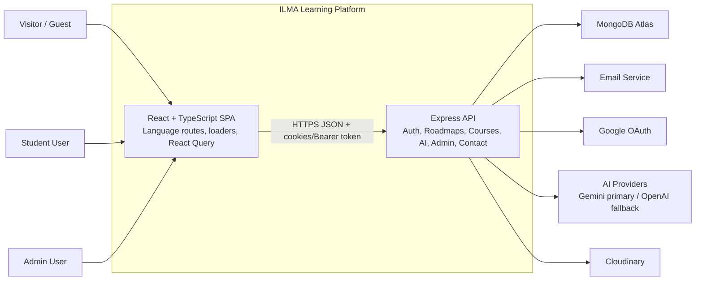

## 2. Use Case Diagram

```mermaid
flowchart LR
    Visitor["Visitor / Guest"]
    Student["Student"]
    Admin["Admin"]
    Google["Google OAuth"]
    Email["Email Service"]
    AI["AI Provider"]
    Cloudinary["Cloudinary"]

    subgraph System["ILMA Learning Platform"]
        UC1(("Select language"))
        UC2(("Browse public roadmaps"))
        UC3(("Browse public courses"))
        UC4(("Send contact message"))
        UC5(("Sign up / Login"))
        UC6(("Verify email / Reset password"))
        UC7(("Manage profile and preferences"))
        UC8(("View dashboard"))
        UC9(("Assign roadmap"))
        UC10(("Track roadmap step progress"))
        UC11(("Enroll in course"))
        UC12(("Track course progress"))
        UC13(("Generate AI roadmap"))
        UC14(("Save AI roadmap"))
        UC15(("Chat with AI assistant"))
        UC16(("Explain roadmap topic"))
        UC17(("Manage users"))
        UC18(("Manage roadmap templates"))
        UC19(("Manage courses"))
        UC20(("Review and reply to contact messages"))
        UC21(("View admin overview and logs"))
        UC22(("Generate admin AI roadmap draft"))
        UC23(("Upload avatar/media"))
    end

    Visitor --> UC1
    Visitor --> UC2
    Visitor --> UC3
    Visitor --> UC4
    Visitor --> UC5
    Visitor --> UC6

    Student --> UC1
    Student --> UC2
    Student --> UC3
    Student --> UC7
    Student --> UC8
    Student --> UC9
    Student --> UC10
    Student --> UC11
    Student --> UC12
    Student --> UC13
    Student --> UC14
    Student --> UC15
    Student --> UC16
    Student --> UC23

    Admin --> UC5
    Admin --> UC6
    Admin --> UC17
    Admin --> UC18
    Admin --> UC19
    Admin --> UC20
    Admin --> UC21
    Admin --> UC22
    Admin --> UC23

    UC5 -.-> Google
    UC6 -.-> Email
    UC4 -.-> Email
    UC20 -.-> Email
    UC13 -.-> AI
    UC15 -.-> AI
    UC16 -.-> AI
    UC22 -.-> AI
    UC23 -.-> Cloudinary
```

## 3. Use Case Partitions

The full use case diagram is intentionally broad. The following partitions split the same behavior by subsystem so each actor goal is easier to explain and trace to routes, pages, and models.

### 3.1 Auth and Account Partition

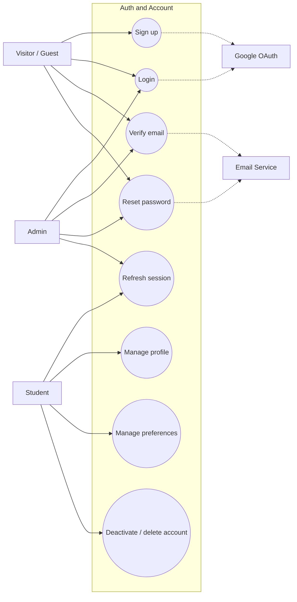

### 3.2 Learning Partition

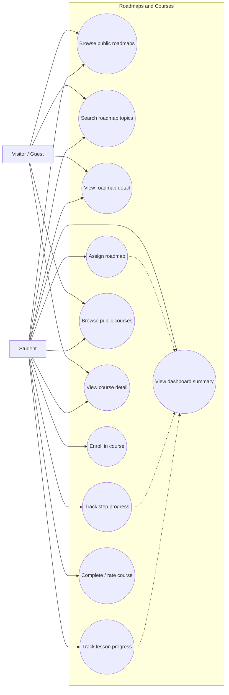

### 3.3 AI Partition

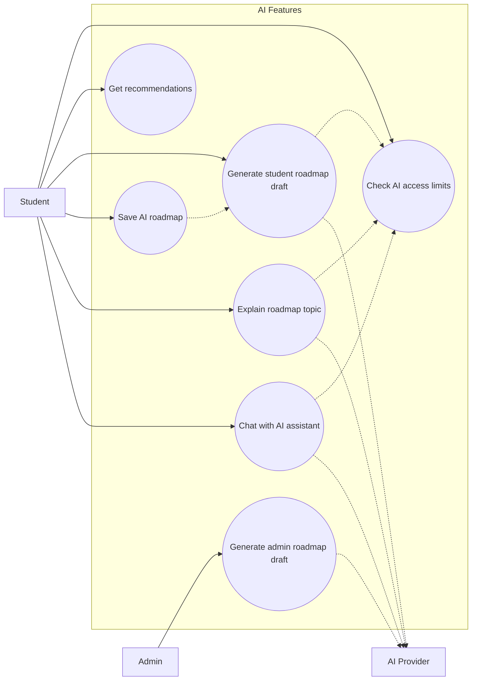

### 3.4 Admin Partition

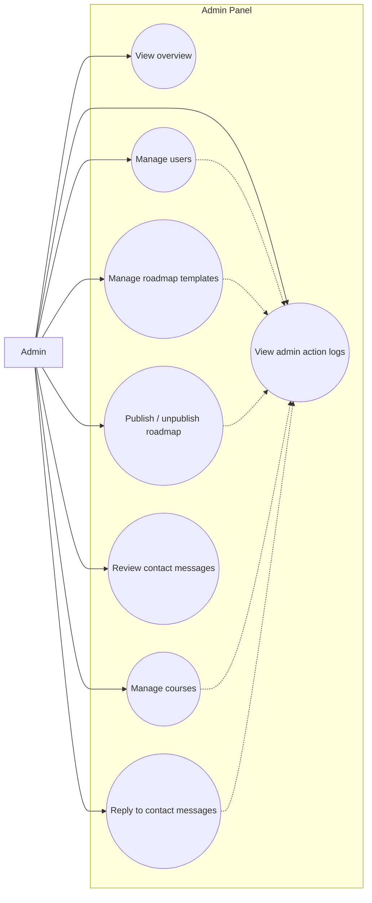

### 3.5 Support and Integration Partition

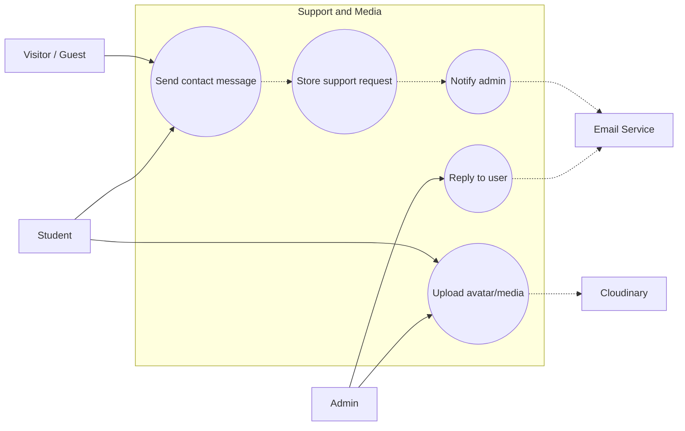

## 4. Sample Use Case Explanations

These sample use cases are smaller than the full diagram and can be used directly in a SWE report. Each one maps to visible frontend pages/API clients and backend routes.

### UC-01: Sign Up and Verify Email

| Field | Description |
| --- | --- |
| Primary actor | Visitor |
| Supporting actors | Email service, optional Google OAuth |
| Goal | Create a student account and verify the email address. |
| Frontend | `SignupPage`, `SignupForm`, `VerifyEmailPage` |
| Backend | `POST /api/auth/signup`, `POST /api/auth/verify-email`, `POST /api/auth/resend-verification-code` |
| Main success scenario | User submits signup data, backend validates uniqueness, account is created, verification code is emailed, user submits code, account becomes verified. |
| Alternate flows | Duplicate email/username fails validation; invalid/expired verification code returns an error; user requests a new verification code. |
| Postcondition | A verified user can access protected student flows after login. |

### UC-02: Assign Roadmap and Track Progress

| Field | Description |
| --- | --- |
| Primary actor | Student |
| Goal | Start a roadmap and track step-by-step learning progress. |
| Frontend | `RoadmapPage`, `MyRoadmapsPage`, `RoadmapGraph`, `StepDetailPanel`, `roadmaps-api.ts` |
| Backend | `GET /api/roadmaps/templates/by-slug/:slug`, `POST /api/roadmaps/assign`, `GET /api/roadmaps/:roadmapId`, `PUT /api/roadmaps/:roadmapId/steps/:stepKey/progress` |
| Main success scenario | Student views a roadmap, assigns it to self, backend creates `UserRoadmap`, student updates step status, backend upserts `UserRoadmapStepProgress` and recalculates roadmap progress. |
| Alternate flows | Already-assigned roadmap is rejected by unique user/template constraint; invalid roadmap ID or step key returns validation/not-found response. |
| Postcondition | Dashboard and roadmap progress views show updated completion percentage. |

### UC-03: Enroll in Course and Complete Lessons

| Field | Description |
| --- | --- |
| Primary actor | Student |
| Goal | Enroll in a course, track lesson completion, and rate or complete the course. |
| Frontend | `CoursePage`, dashboard course components, `courses-api.ts` |
| Backend | `GET /api/courses/published/:slug`, `POST /api/courses/enroll`, `PUT /api/courses/:courseId/progress`, `POST /api/courses/:courseId/complete`, `POST /api/courses/:courseId/rate` |
| Main success scenario | Student opens a published course, enrolls, backend creates `UserCourseProgress`, lesson progress updates completed lesson IDs and progress percent, student completes and rates the course. |
| Alternate flows | Unpublished/deleted course is unavailable publicly; progress updates require existing enrollment; rating requires enrollment. |
| Postcondition | Course progress, dashboard totals, and course stats reflect the student's work. |

### UC-04: Generate and Save AI Roadmap

| Field | Description |
| --- | --- |
| Primary actor | Student |
| Supporting actor | AI provider |
| Goal | Generate a personalized roadmap draft and save it as a tracked roadmap. |
| Frontend | `AiRoadmapPage`, `AiRoadmapManager`, `ai-api.ts`, `useAiMutations.ts` |
| Backend | `GET /api/ai/features/access`, `POST /api/ai/roadmaps/user-draft`, `POST /api/ai/roadmaps/save` |
| Main success scenario | Student enters goal and study constraints, backend checks AI usage limits, provider returns a structured draft, student saves it, backend creates a user-owned `RoadmapTemplate` and assigned `UserRoadmap`. |
| Alternate flows | Usage limit blocks generation; AI provider error returns sanitized failure; invalid draft payload is rejected during save. |
| Postcondition | Saved AI roadmap appears in the student's roadmap list. |

### UC-05: Admin Manage Course

| Field | Description |
| --- | --- |
| Primary actor | Admin |
| Goal | Create, edit, publish, or delete course content. |
| Frontend | `AdminCoursesPage`, `AdminCourseDetailPage`, `AdminCourseFormModal`, `admin-api.ts` |
| Backend | `GET /api/admin/courses`, `POST /api/admin/courses`, `GET /api/admin/courses/:courseId`, `PATCH /api/admin/courses/:courseId`, `DELETE /api/admin/courses/:courseId` |
| Main success scenario | Admin opens course list, creates or edits course metadata/sections/lessons, backend validates payload, saves `Course`, and records an `AdminActionLog`. |
| Alternate flows | Invalid course schema returns validation errors; delete is soft-delete via `deletedAt`; non-admin users are blocked by `authorizeRoles("admin")`. |
| Postcondition | Public catalog reflects published, non-deleted courses. |

### UC-06: Contact Support and Admin Reply

| Field | Description |
| --- | --- |
| Primary actor | Visitor or Student |
| Supporting actor | Admin, email service |
| Goal | Send a support message and receive an admin reply. |
| Frontend | `ContactUsPage`, `ContactForm`, `AdminContactMessagesPage`, `contact-api.ts`, `admin-api.ts` |
| Backend | `POST /api/contact`, `GET /api/admin/contact-messages`, `POST /api/admin/contact-messages/:contactMessageId/reply` |
| Main success scenario | User submits contact form, backend stores `ContactMessage` and notifies admins, admin reviews inbox and sends reply, backend appends reply and emails the user. |
| Alternate flows | Invalid contact form fails validation; mailer misconfiguration can return service error for public contact submission. |
| Postcondition | Contact message status becomes replied and reply metadata is stored. |

## 5. Container Diagram

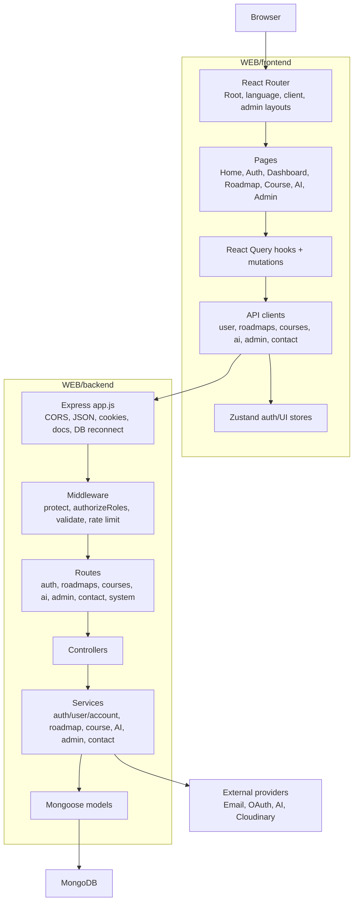

## 6. Backend Component Diagram

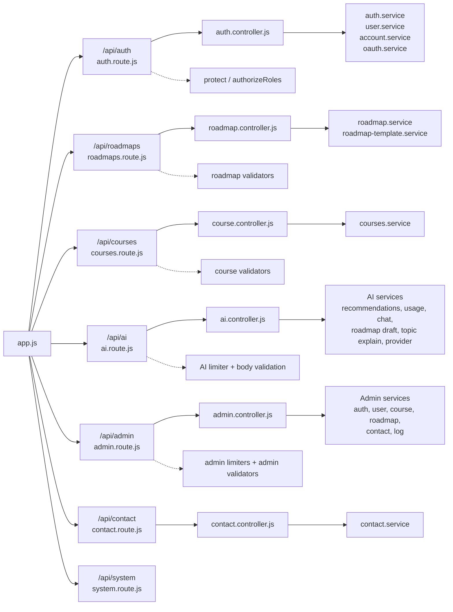

## 7. Frontend Routing and API Diagram

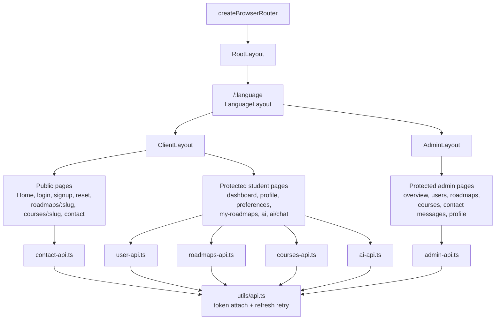

## 8. Domain Class Diagram

```mermaid
classDiagram
    class User {
      ObjectId _id
      string username
      string email
      string role
      boolean isVerified
      boolean isActive
      LoginStreak loginStreak
      Subscription subscription
      ObjectId currentRoadmap
    }

    class UserProfile {
      ObjectId user
      string bio
      string avatarUrl
      string visibility
      string location
      string headline
    }

    class UserPreference {
      ObjectId user
      string[] interests
      string[] preferredLanguages
      string[] learningGoals
      string skillLevel
      string learningPace
      number weeklyStudyHours
    }

    class RoadmapTemplate {
      string title
      string slug
      string goal
      string targetRole
      string targetLevel
      string templateType
      string source
      string visibility
      boolean isActive
      RoadmapStep[] steps
    }

    class RoadmapStep {
      string stepKey
      string title
      number order
      number estimatedMinutes
      boolean required
      string[] dependsOn
    }

    class UserRoadmap {
      ObjectId user
      ObjectId template
      string status
      number currentStepIndex
      number progressPercent
      Date targetDate
    }

    class UserRoadmapStepProgress {
      ObjectId user
      ObjectId roadmap
      ObjectId template
      string stepKey
      ObjectId course
      string status
      number score
      number timeSpentMinutes
    }

    class Course {
      string title
      string slug
      string level
      string category
      boolean isPublished
      boolean isFeatured
      CourseSection[] sections
      CourseStats stats
    }

    class CourseSection {
      string sectionKey
      string title
      number order
      Lesson[] lessons
    }

    class UserCourseProgress {
      ObjectId user
      ObjectId course
      ObjectId roadmap
      string status
      string currentLesson
      string[] completedLessonIds
      number progressPercent
      number rating
    }

    class UserActivity {
      ObjectId user
      string type
      ObjectId course
      ObjectId roadmap
      string roadmapStepKey
      mixed metadata
    }

    class UserAiUsage {
      ObjectId user
      string type
      Date periodStart
      number count
      number totalTokens
    }

    class UserAiConversation {
      ObjectId user
      string title
      object context
      Date lastMessageAt
      Date deletedAt
    }

    class UserAiMessage {
      ObjectId conversation
      ObjectId user
      string role
      string content
      string provider
      string model
      AiChatLink[] links
    }

    class ContactMessage {
      string name
      string email
      string message
      string status
      ContactReply[] replies
    }

    class AdminActionLog {
      ObjectId admin
      string action
      string targetType
      ObjectId targetId
      mixed metadata
    }

    User "1" --> "0..1" UserProfile
    User "1" --> "0..1" UserPreference
    User "1" --> "0..*" UserRoadmap
    User "1" --> "0..*" UserCourseProgress
    User "1" --> "0..*" UserActivity
    User "1" --> "0..*" UserAiUsage
    User "1" --> "0..*" UserAiConversation
    User "1" --> "0..*" AdminActionLog : admin
    RoadmapTemplate "1" *-- "1..*" RoadmapStep
    RoadmapTemplate "1" --> "0..*" UserRoadmap
    UserRoadmap "1" --> "0..*" UserRoadmapStepProgress
    Course "1" *-- "0..*" CourseSection
    Course "1" --> "0..*" UserCourseProgress
    Course "0..1" --> "0..*" UserRoadmapStepProgress
    UserAiConversation "1" --> "0..*" UserAiMessage
    ContactMessage "1" --> "0..*" ContactReply
```

## 9. ER Diagram

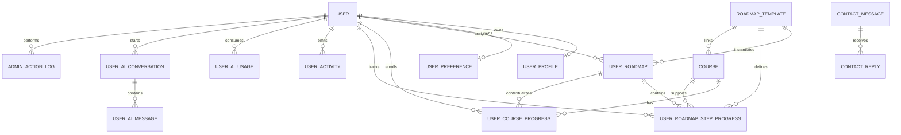

## 10. Authentication Sequence

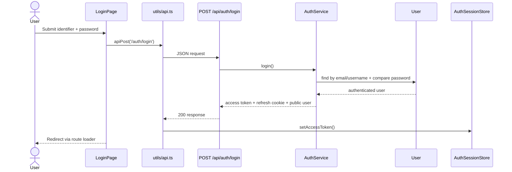

## 11. Protected Request and Token Refresh Sequence

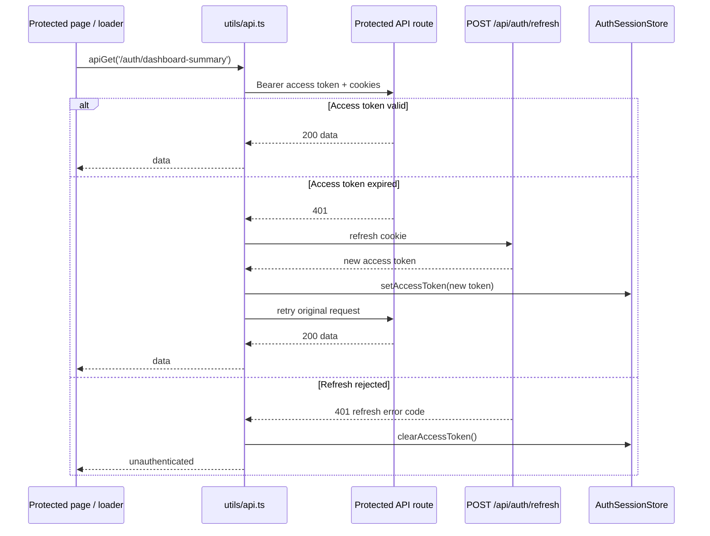

## 12. Roadmap Assignment and Step Progress Sequence

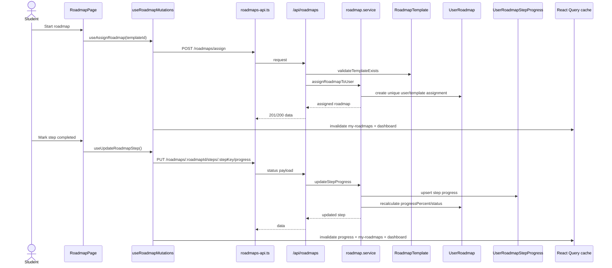

## 13. Course Browse and Progress Sequence

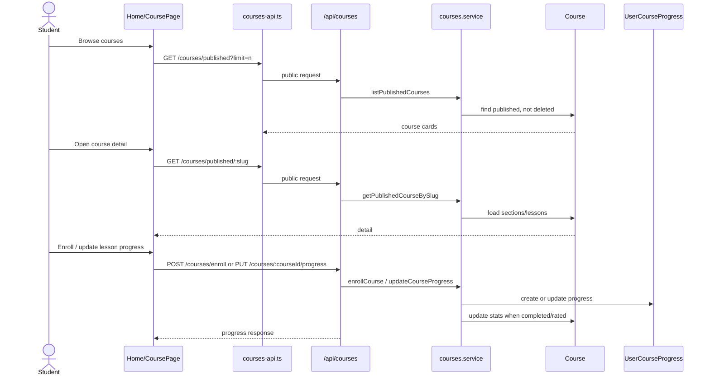

## 14. AI Roadmap Generation Sequence

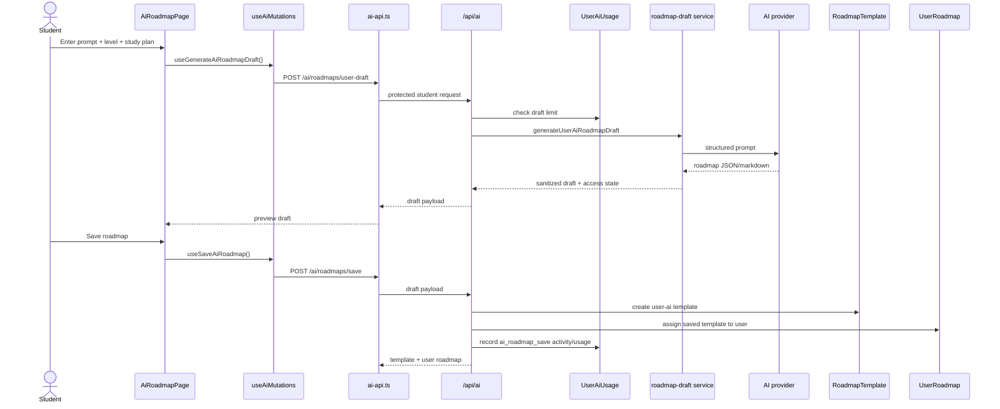

## 15. AI Chat Sequence

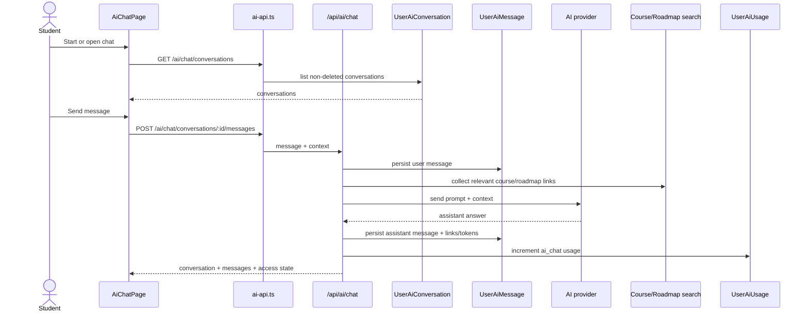

## 16. Admin Content Management Sequence

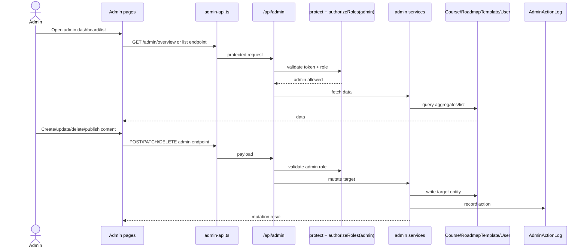

## 17. Contact Support Sequence

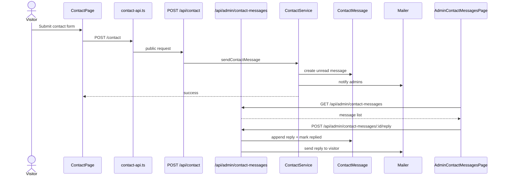

## 18. State Diagram: User Roadmap

```mermaid
stateDiagram-v2
    [*] --> assigned: POST /roadmaps/assign
    assigned --> inProgress: first step started/completed
    inProgress --> paused: user/admin pause workflow
    paused --> inProgress: resume
    inProgress --> completed: progressPercent = 100
    assigned --> archived: archive status
    inProgress --> archived: archive status
    completed --> archived: archive status
    assigned --> [*]: DELETE /roadmaps/:roadmapId
    inProgress --> [*]: DELETE /roadmaps/:roadmapId
    completed --> [*]: DELETE /roadmaps/:roadmapId
```

## 19. State Diagram: Course Progress

```mermaid
stateDiagram-v2
    [*] --> notStarted: POST /courses/enroll
    notStarted --> inProgress: PUT /courses/:courseId/progress
    inProgress --> completed: POST /courses/:courseId/complete or all lessons done
    inProgress --> abandoned: POST /courses/:courseId/abandon
    abandoned --> inProgress: re-enroll/update progress
```

## 20. Deployment Runtime View

```mermaid
flowchart LR
    UserBrowser["User browser"]
    FrontendHost["Frontend host<br/>Vite build / Vercel-compatible"]
    BackendHost["Backend host<br/>Express server / serverless-compatible"]
    Mongo["MongoDB Atlas"]
    Providers["Providers<br/>Email, OAuth, AI, Cloudinary"]

    UserBrowser --> FrontendHost
    FrontendHost -->|static assets| UserBrowser
    UserBrowser -->|VITE_API_BASE_URL / local API base| BackendHost
    BackendHost --> Mongo
    BackendHost --> Providers
```

## 21. Route Surface Summary

| Route group | Public endpoints | Protected student endpoints | Protected admin endpoints |
| --- | --- | --- | --- |
| `/api/auth` | signup, login, verify email, password reset, Google OAuth, token refresh | logout, check-auth, preferences, dashboard summary, profile/avatar/password, account lifecycle | N/A |
| `/api/roadmaps` | search, list templates, template by ID/slug, topic by step | my templates by slug, assign, list assigned roadmaps, progress, step progress, delete assignment | template CRUD/publish/unpublish/steps through role-protected route |
| `/api/courses` | published list, published detail by slug | enroll, list my courses, progress, complete, rate, abandon | N/A |
| `/api/ai` | N/A | recommendations, feature access, chat, user roadmap draft/save/visibility, topic explanation | admin roadmap draft |
| `/api/admin` | admin auth login/verify/reset | N/A | overview, users, roadmaps, courses, contact messages, logs, auth check/logout |
| `/api/contact` | submit contact message | N/A | admin replies through `/api/admin/contact-messages/:id/reply` |
